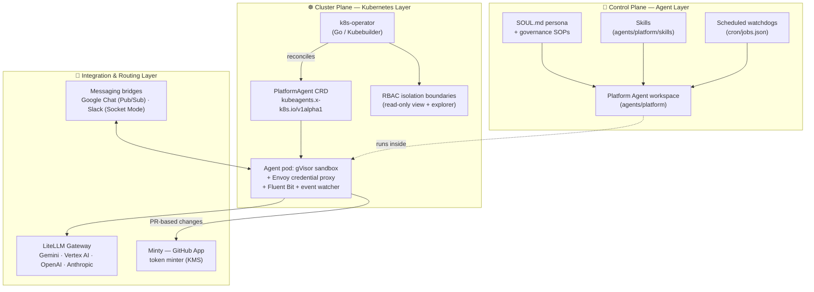

# 🧭 kube-agents — The Kubernetes Agentic Harness

**Stop driving your clusters. Start delegating them.**

`kube-agents` replaces the traditional imperative DevOps presentation layer — `kubectl`, `gcloud`, the Google Cloud Console — with autonomous, proactive AI agents that manage your Kubernetes/GKE infrastructure, enforce multi-tenant governance, and continuously audit security posture. Instead of you reacting to pages and typing commands, a **Platform Agent** watches your fleet around the clock, opens pull requests with fixes, and reports to you in chat.

| Traditional Ops                              | With `kube-agents`                                                                                           |
| -------------------------------------------- | ------------------------------------------------------------------------------------------------------------ |
| Reactive, manual toil (`kubectl` + runbooks) | Proactive, intent-driven operations                                                                          |
| Drift discovered during incidents            | Scheduled compliance & blueprint audits ([autonomous watchdogs](agents/platform/cron/jobs.json))             |
| Hand-rolled RBAC and tenancy reviews         | Automated RBAC & boundary enforcement, [credential isolation by design](docs/credential-isolation-design.md) |
| Patch Tuesdays and CVE spreadsheets          | Daily vulnerability & patch scans with staggered rollout orchestration                                       |
| One human, one terminal                      | ChatOps with the agent over Google Chat & Slack                                                              |

📗 **Full documentation: [gke-labs.github.io/kube-agents](https://gke-labs.github.io/kube-agents/)**

[](https://gke-labs.github.io/kube-agents/)

_An SRE asks for a fleet self-health check; the agent answers in the thread. An illustrative replay — the names and figures are examples. It runs live at the top of the [documentation site](https://gke-labs.github.io/kube-agents/)._

---

## ⚡ Try it now

The fastest, zero-friction way to install `kube-agents` in **Google Cloud Shell** or your terminal:

```bash
curl -fsSL https://gke-labs.github.io/kube-agents/install.sh | bash
```

_(Or via GitHub raw URL: `curl -fsSL https://raw.githubusercontent.com/gke-labs/kube-agents/main/install.sh | bash`)_

This interactive installer guides you through GCP authentication, project selection, GKE Standard cluster setup, chat integrations (Google Chat & Slack), and LLM model provider credentials.

### 🤖 AI Agent & Automation Usage

AI Agents and CI/CD pipelines can invoke `install.sh` non-interactively using CLI flags or `--dry-run` inspection:

```bash
curl -fsSL https://gke-labs.github.io/kube-agents/install.sh | bash -s -- \
  --non-interactive \
  --project-id="my-gcp-project" \
  --cluster-name="platform-agent" \
  --image-tag="<SEMVER_TAG_OR_FULL_COMMIT_SHA>" \
  --model-provider="gemini" \
  --permission-set="read-only"
```

Or delegate setup directly to your AI coding agent:

```text
"Using kube-agents/INSTALL.md provision k8s agentic harness and create platform agent"
```

Prefer the scripted path? From an authenticated `gcloud`:

```bash
cd k8s-operator
make gcp-provision
```

This runs the staged, idempotent provisioning scripts end to end — from GKE cluster creation through IAM and chat integration to the optional inference stack. `make gcp-teardown` reverses it. See the [quick start](https://gke-labs.github.io/kube-agents/install/quickstart-gke/) for the walkthrough, or [INSTALL.md](INSTALL.md) for manual and local-development paths.

---

## 📖 What it is

The harness runs co-located agents in a single operator-deployed pod: the **Chat Agent** — the conversational front door that receives every chat message and delegates work over a shared kanban board — the **Platform Agent** — the master custodian and agent architect that manages the GKE infrastructure lifecycle, establishes multi-tenancy boundaries, and enforces fleet-wide compliance — and a **Cluster Agent** per managed cluster, a single-cluster SRE persona the Platform Agent scaffolds from the [`agents/cluster/`](agents/cluster/) template for runtime operations and workload debugging, with read-only access to the cluster it watches. The Platform Agent is driven by:

- 🧬 **A persona** — [`agents/platform/SOUL.md`](agents/platform/SOUL.md) defines its identity, its _Automation First_ rule (no manual cluster mutations; changes flow through declarative, PR-based workflows), and its _Least Privilege_ constraint.
- 📚 **Governance playbooks** — SOPs in [`agents/platform/governance/`](agents/platform/governance/) covering blueprint sync, compliance audits, cost analysis, capacity orchestration, security patch orchestration, and lifecycle management.
- 🛠️ **Skills** — task-focused `SKILL.md` bundles under [`agents/platform/skills/`](agents/platform/skills/): cluster creation, app onboarding, cost analysis, backup & DR, and manifest generation. Single-cluster runtime skills — workload troubleshooting, observability, autoscaling, storage — belong to the Cluster Agent in [`agents/cluster/skills/`](agents/cluster/skills/). See the [skill catalog](https://gke-labs.github.io/kube-agents/skills/).
- ⏰ **Autonomous watchdogs** — cron-driven governance jobs in [`agents/platform/cron/jobs.json`](agents/platform/cron/jobs.json) that keep the fleet honest without human prompting. Ticking belongs to the Chat Agent's gateway, the only running one, so a job on its roster advances the Platform Agent's schedule once a minute. See [proactive autonomy](https://gke-labs.github.io/kube-agents/overview/proactive-autonomy/).

The runtime is built on the Hermes agent framework and wires in MCP servers for platform control and GKE's hosted MCP endpoint, so the agent speaks to your clusters through structured tools rather than raw shell access.

---

## 🛡️ Governance & isolation

`kube-agents` is designed for enterprise fleets where agents must be powerful _and_ provably contained:

- **Least-privilege RBAC** — the agent's Kubernetes identity is read-only and cannot read Secrets.
- **Credential isolation** — the agent sandbox container never receives API keys or tokens; an Envoy credential-proxy sidecar injects them at the network boundary.
- **At-rest database encryption & state security** — GKE etcd database encryption (CMEK) via Cloud KMS, strict state file permissions (`umask 077`), and mandatory encryption pre-flight gates.
- **Kernel-level sandboxing** — agent workloads can run under a gVisor RuntimeClass (GKE Sandbox).
- **GitOps-only mutations** — infrastructure changes are proposed as pull requests for human review.

Exactly what is _enforced_ on which plane — Kubernetes RBAC, GCP IAM, and the GitOps path each answer differently — is set out in [Security & IAM](https://gke-labs.github.io/kube-agents/reference/security-and-iam/#what-the-agent-can-and-cannot-do). Read that before granting the agent access to a production project.

---

## 🏗️ Architecture



Walkthrough: [Architecture](https://gke-labs.github.io/kube-agents/overview/architecture/). The [`k8s-operator/`](k8s-operator/) reconciles `PlatformAgent` custom resources into the sandboxed agent pod, its sidecars, per-agent ServiceAccounts with Workload Identity, read-only RBAC, and Services.

> **Looking for the end-state design?** [`docs/architecture/`](docs/architecture/) specifies a three-tier, fully read-only agent model that this repository is converging toward. It describes the target, not what ships today.

---

## 🤝 Contributing

Contributions are welcome. See [docs/contributing.md](docs/contributing.md) for CLA requirements and the [contributing guide](https://gke-labs.github.io/kube-agents/contributing/) for PR hygiene, commit conventions, and the local checks CI enforces. Repository conventions for AI coding agents are in [AGENTS.md](AGENTS.md).

## Disclaimer

This is not an officially supported Google product.

This project is not eligible for the Google Open Source Software Vulnerability Rewards Program.
