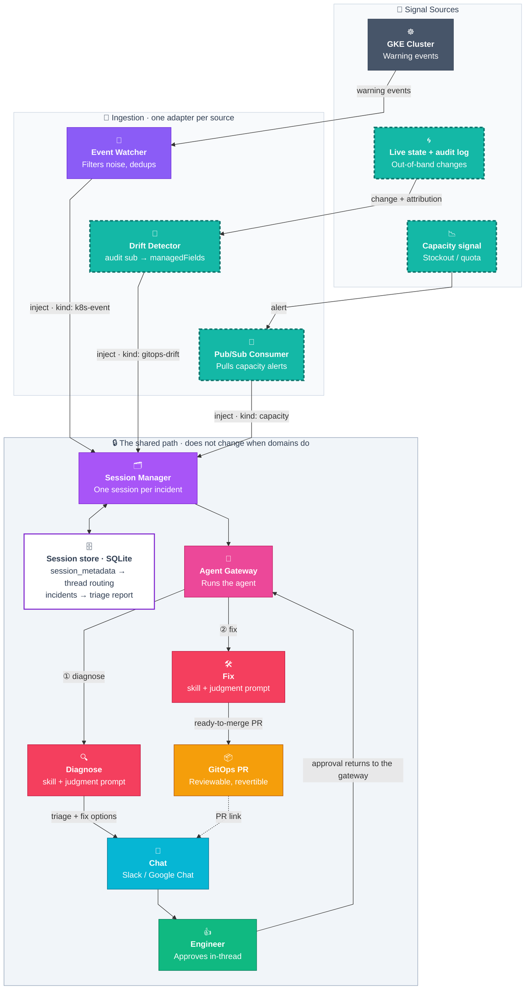

# AutoOps — Architecture

One path from operational signal to GitOps pull request, with a human in the middle.
New domains plug into that path instead of rebuilding it.

AutoOps is not a troubleshooting bot. It is an extension architecture: a fixed pipeline that turns
_something happened_ into _someone approved a reviewable change_, plus a small set of contracts that
a new operational domain implements to ride that pipeline. Incident triage is the first domain on it,
not the product.



> **Legend:** solid = live today · dashed teal = what a new domain supplies (its source and its adapter).
> Everything inside the shaded band already ships. Judgment sits inside the band but is _parameterized_
> per domain — see [Contract 3](#contract-3--judgment).
>
> **① and ② are two turns of one session, not one call.** Each turn is an agentic loop — the agent
> iterates over tools until it has an answer — and the second turn only starts when an engineer approves
> in-thread, which routes back through the gateway. The session store is what makes the gap survivable:
> `incidents` holds the triage report and its fix options, so a reply of _"apply Option B"_ hours later
> still resolves. The Session Manager is ours (`session_kv_server.py`, SQLite-backed); the Agent Gateway
> is the Hermes REST endpoint it calls to run each turn.

## What qualifies as a domain

The pipeline handles one shape of problem:

1. **A signal arrives** — something changed, broke, or crossed a line.
2. **Someone has to judge it** — the right answer needs context a static rule can't hold, and reasonable
   engineers could disagree.
3. **The fix lands as a reviewed change** — a pull request a human approves, not a mutation on a live cluster.

If step 2 is a lookup table, use a policy engine. If step 1 never fires on its own, there is nothing to
react to.

**Day 2 is the scope.** This pipeline reacts to what a running fleet does. Day 0 authoring and
provisioning — writing blueprints, standing up clusters, laying down a mesh — is a different product
surface, and deliberately not this one.

## The platform is five contracts

A domain plugs in by satisfying five contracts. Four of them are already implemented and shared; the
fifth (judgment) is shared machinery with per-domain content.

| #   | Contract            | What it settles                                           |
| --- | ------------------- | --------------------------------------------------------- |
| 1   | **Ingestion**       | How a signal becomes an inject on the pipeline            |
| 2   | **Session & state** | What "one incident" means, and what is remembered         |
| 3   | **Judgment**        | What the agent is asked to decide, and how it must answer |
| 4   | **Context reach**   | What the agent can actually read                          |
| 5   | **Remediation**     | How a decision becomes a change                           |

---

### Contract 1 · Ingestion

**One adapter per source.**

The adapter owns everything source-specific: authentication, payload parsing, noise thresholds,
and deduplication. The `kind` field is the discriminator skills match on, so a second source ships
a different constant rather than a different path.

The Go event watcher marshals an `InjectPayload`, wraps it as `{"message": "<escaped JSON>"}`, and
`POST`s it to `/sessions/{id}/inject` (`k8s-operator/cmd/k8s-event-watcher/injector.go`). The watcher
sends **no prompt** — it sends facts. Noise control lives here too: namespace allow/deny rules, a
flapping guard, and a 24h dedup window keyed on `EventKey{UID, Reason}`, so a crashlooping pod is one
incident rather than forty.

**A new domain supplies:** an adapter that detects its signal, filters its own noise, and emits the
inject envelope with its own `kind`.

> **Honest state:** the envelope is still k8s-shaped — `reason`, `namespace`, `kind_of_object`, `name`,
> `message`. Generalizing it is part of the work of landing the second source, not a box already ticked.

---

### Contract 2 · Session & state

**One session per incident, held in two tables**
(`agents/platform/scripts/session_kv_server.py`):

```sql
CREATE TABLE session_metadata (        CREATE TABLE incidents (
  session_id TEXT PRIMARY KEY,           chat_id    TEXT NOT NULL,
  metadata   TEXT NOT NULL,              thread_id  TEXT NOT NULL,
  updated_at TIMESTAMP                   report     TEXT NOT NULL,
);                                       created_at TIMESTAMP,
                                         PRIMARY KEY (chat_id, thread_id)
                                       );
```

**`session_metadata`** maps a session to its chat thread, so a reply in that thread routes back to the
same session instead of starting a new one.

**`incidents`** keeps the first triage report per thread — the one carrying the fix options. Written
`INSERT OR IGNORE`, so later chatter cannot overwrite the decision record.

This is what makes follow-up work: an engineer replies _"apply Option B"_ hours later, and the agent still
knows what Option B was. Both tables expire on a TTL sweep (`SESSION_KV_CLEANUP_TTL_DAYS`, default 14).

**A new domain supplies:** nothing. It inherits sessions, thread routing, and follow-up for free.

#### What it unlocks — every incident leaves a written report behind

The `incidents` table is already an incident corpus in embryo — every triage the fleet has produced,
in one place:

- **A postmortem draft**, written from the triage and the approved fix, not from memory a week later.
- **Recurrence matching** — match a new incident against past ones and surface the fix that actually worked.
- **Fleet failure patterns** — what breaks, where, and how often. A reliability review built from real incidents.
- **An eval set** — past reports plus what humans approved is a labelled set for scoring the agent.

None of this is built yet. Resource keys, a captured outcome, and retention past the TTL are what turn
that table into a corpus, and they are small changes to a table we already write.

---

### Contract 3 · Judgment

**Every domain writes its judgment prompt.**

The watcher sends JSON. `_build_agent_query()` (`session_kv_server.py:245`) turns it into one string,
and that string decides how the whole interaction behaves. Every new domain writes one of these, next
to its skill. Abridged, as it runs today:

```
Analyze the following Kubernetes event warning on GKE cluster '{cluster}'
for the active session '{session_id}'.

**Event Details:**
• *Resource:* {namespace}/{kind}/{name}
• *Event Reason:* {reason}
• *Warning Message:* {message}

When done, post your final diagnostic report ... formatted exactly like this:

📋 *Incident Triage*
• *Issue:*       <1-sentence description of the problem>
• *Root Cause:*  <key constraint mismatch or log finding>

🛠️ *Proposed Fixes (GitOps):*
*Option A (<Action Title>):* <1-sentence GitOps fix>
*Option B (<Action Title>):* <1-sentence GitOps fix>

👉 *Reply to this thread with 'apply Option A' or 'apply Option B' ...*

**GitOps PR Instructions (for subsequent turns):**
1. You are explicitly authorized to create a branch, modify manifests, commit, push, open a PR.
3. Do not execute any write mutations (kubectl scale, patch, or apply) directly on the live cluster.
```

**What that one string pins down** — three design decisions, not formatting preferences:

- **The report shape** — a fixed layout the reader learns once. Consistency across domains is what makes
  the output skimmable at 3am.
- **The approval interaction** — the exact words that turn a suggestion into an authorized action, and
  the fact that a reply is required at all.
- **The write boundary** — the agent may open a PR; it may not touch the live cluster. This is the
  safety property of the whole architecture, and it is stated in the prompt.

A domain also registers a **skill** in the catalog (`agents/platform/skills/`), which supplies the
diagnostic procedure — e.g. `gke-workload-troubleshooting` walks pod status → namespace events →
container logs → service and NetworkPolicy checks → propose a GitOps correction. `SOUL.md` §7 requires
the agent to query the catalog and load the matching domain skill before diagnosing, and §8 imposes a
communication policy on the result: a three-part layout, a jargon translation table (`OOMKilled` →
"the application ran out of allocated memory"), and a pre-report self-audit that demands quoted command
output, resource names, and UTC timestamps.

**So a new domain supplies two things: a skill and a judgment prompt.** The skill is _how to investigate_;
the prompt is _what to decide and how to say it_.

> **Honest state:** `_build_agent_query()` is hardcoded k8s-event-shaped, so today a second domain means
> a second query builder. Making it pluggable is the same piece of work as generalizing the envelope.

---

### Contract 4 · Context reach

**Judgment is capped by what the tools can see.**

The agent can only connect domains its tools can read. Every tool added widens the set of answerable
questions, with no pipeline change.

| Surface                                                      | Reaches                                                | Status    |
| ------------------------------------------------------------ | ------------------------------------------------------ | --------- |
| `kubectl` / `gcloud` via `platform_control` + hosted GKE MCP | k8s events, pod state, logs, RBAC, networking, storage | **Wired** |
| Prometheus / PromQL MCP                                      | Metric values, saturation, scale-up pressure           | Future    |
| Quota inspection                                             | Compute, IP space, `SSD_TOTAL_GB` and friends          | Future    |
| Runbook / knowledge retrieval                                | Team-specific procedure and history                    | Future    |

Two MCP servers are configured in `agents/platform/config.yaml`: `platform_control` (local) and the
hosted `gke` endpoint. Adding a tool is additive and requires no pipeline change — but until a tool
exists, the journeys that depend on it are out of reach, and saying otherwise on a slide is how
architectures lose credibility.

**A new domain supplies:** whatever tools its judgment needs that are not already wired.

---

### Contract 5 · Remediation

**One safe write path for every domain.**

Every domain ends in the same place: a pull request. Not a mutation, not an auto-heal, not a direct
`kubectl apply`. The agent proposes, an engineer approves in-thread, and the change lands as a branch,
a diff, and a PR link posted back to the same thread.

This is why the write boundary is stated in the prompt rather than only enforced in tooling — the model
is told the rule in the same breath it is told the task. Because remediation is a pull request rather
than a live write, a new domain inherits reviewability and rollback for free.

**A new domain supplies:** nothing, unless it needs a different target (Terraform, a runbook execution)
— in which case that is a new remediation adapter behind the same approval loop.

---

## What ships today — signal to pull request, with a human in the middle

The GKE-events path is live end to end:

- **Detection** — `k8s-event-watcher` streams warning events in real time (`OOMKilled`,
  `CrashLoopBackOff`, `FailedScheduling`, `Evicted`, ~12 reasons total), with namespace deny/allow rules
  and a flapping guard.
- **Dedup** — a 24h rolling window collapses repeats and related reasons into one incident.
- **Session + routing** — one session per incident, SQLite-backed, posted to the right chat thread, with
  the triage report stored for follow-up replies.
- **Judgment** — the Platform Agent loads the matching skill, diagnoses root cause, and posts a
  plain-language triage with two GitOps fix options.
- **Human-in-the-loop** — an engineer approves in-thread; nothing reaches production without it.
- **Remediation** — the approved fix ships as a GitOps PR.

## Plugging in a new domain

Each new domain adds a source, an adapter, a skill, and a judgment prompt. In order:

1. **A signal** — something that fires on its own.
2. **An adapter** — detects the signal, filters its own noise, emits the inject envelope with a new `kind`.
3. **A skill** — the diagnostic procedure, registered in `agents/platform/skills/`.
4. **A judgment prompt** — what to decide, what shape the answer takes, what the approval words are.

Sessions, thread routing, follow-up memory, chat delivery, the approval gate, and PR generation are not
on the list. That is the point.

## What else fits this path

Anything with the same shape rides the same pipeline: a signal arrives, someone has to judge it, the
fix lands as a reviewed change. Each of these is an adapter, a skill, and a judgment prompt away.

| Domain                       | The signal                                | State     |
| ---------------------------- | ----------------------------------------- | --------- |
| **Incident triage**          | Warning event on a workload               | **Live**  |
| **Drift detection**          | Out-of-band change in the audit log       | Candidate |
| **Obtainability governance** | Stockout investigator                     | Candidate |
| **Shadow infrastructure**    | Unmanaged resource found in inventory     | Candidate |
| **Policy propagation**       | Policy missing on a cluster in the fleet  | Candidate |
| **Add-on lifecycle**         | Add-on version or health goes out of band | Candidate |

### Domains grow. The pipeline doesn't.

**Drift detection — two contracts touched.** Emits `kind: gitops-drift`. Takes no dependency on any
GitOps tool, so it works on every cluster and covers resources no tool manages. Argo and Flux become
optional enrichment, never a prerequisite. It has a full design doc and a completed attribution spike:
`managedFields` gives field-level ownership, the audit log gives the principal, and the two-signal join
separates a human out-of-band change from CI and from controller churn (~99% noise reduction with two
static filters).

**Obtainability governance — the same two contracts.** A completely different domain, engineered
independently, arrived at the same shape. It also closes the quota and capacity gap that previously
bounded cross-domain troubleshooting.

## The CUJs that make this worth building

Single-domain failures (an OOMKill, a bad image tag) are easy — one engineer, one dashboard, done. The
journeys that hurt are **cross-domain**: the symptom surfaces in one domain but the root cause lives in
another, so the human looking at it can't fix it and a multi-team hand-off begins. That hand-off is
where incident time goes, and it is exactly what one agent, pulling whatever context its tools expose in
a single session, can collapse.

| Symptom (where the human looks)       | Root cause (where the fix is)               | Real example                                                                          |
| ------------------------------------- | ------------------------------------------- | ------------------------------------------------------------------------------------- |
| Pods stuck **Pending** — _Workload_   | **Scheduling** / **capacity / quota**       | Insufficient GPU · untolerated taint · `SSD_TOTAL_GB` quota exceeded on PVC provision |
| **Scale-up failing** — _Scalability_  | **Quota** exhausted in Compute / networking | `scale.up.error.quota.exceeded` · `IP_SPACE_EXHAUSTED`                                |
| **App not starting** — _Workload_     | **Networking** path broken                  | ImagePullBackOff · webhook i/o timeout · "service not ready"                          |
| **Control plane unreachable** — _IAM_ | **Security** credential expiry              | `x509: certificate has expired` on cluster init                                       |
| **App request denied** — _Workload_   | **RBAC** policy                             | `…is forbidden: …authorization.k8s.io`                                                |

Rows grounded in events, logs, RBAC, and networking config are within reach today via `kubectl` /
`gcloud`. The scale-up and capacity rows depend on the metrics and quota gaps in
[Contract 4](#contract-4--context-reach).

## What this architecture enables

> **The differentiator:** turn a _Workload_ symptom into a _Networking_ or _RBAC_ root cause **without a
> human relay race** — the agent correlates symptom domain to cause domain in one session, and each new
> tool widens what it can correlate.

- **One front door, many signals** — every signal becomes an incident on the same path; no per-source runbook.
- **Cross-domain root-cause correlation** — follow the symptom to the real cause across domains.
- **Consistent, safe remediation** — whatever the domain, the fix lands as a reviewable PR behind approval.
- **Coverage that compounds** — each new domain inherits session, memory, chat, approval, and PR for free,
  so the catalog grows without new plumbing.

## Known gaps

Stated plainly, because they scope the next milestone:

- **The inject envelope is k8s-shaped**, and so is `_build_agent_query()`. The second domain generalizes both.
- **No incident corpus yet** — the `incidents` table has the data but not the keys, outcomes, or retention.
- **No metric or quota tooling** — two of the five cross-domain CUJ rows are blocked on it.
- **Judgment has no regression harness** — judgment is the differentiator, so it needs an eval suite.
- **Outbound is chat-only** — the only paths out are the chat thread and the PR link posted into it.
  Nothing acks or resolves the originating signal (a PagerDuty incident, a monitoring alert). A PRD on
  outbound paths is in flight; the shape is a status adapter mirroring the ingestion adapters.

## Related

- [`session_management.md`](session_management.md) — session lifecycle and chat-thread routing in detail
