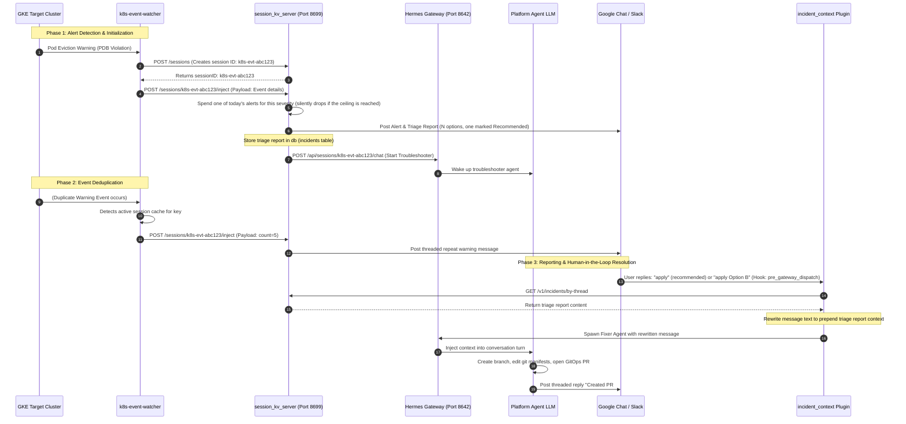

# Platform Session Management & Incident Triage Flow

This document details the architecture and workflow for routing GKE Kubernetes warning alerts into persistent diagnostic agent sessions, enabling interactive threaded troubleshooting in chat platforms (Google Chat and Slack).

---

## Architecture Overview

AI agent execution is typically stateless and triggered on-demand. To support proactive GKE warning troubleshooting, we run a local stateful proxy server called `session_kv_server.py` (the REST Bridge) on the Platform Agent host on `127.0.0.1:8699`.

This server acts as a bridge between the **GKE Event Watcher** (monitoring target clusters) and the **Platform Agent Gateway** (running the LLM reasoning turns).

It binds loopback rather than `0.0.0.0` because it has exactly three callers and all of them share this Pod's network namespace: the event watcher in the credential-proxy container, the Platform MCP server, and the `incident_context` plugin. Every route except `/healthz` also requires a bearer token from the `SESSION_KV_API_KEY` key of the agent's Secret — the rows it serves carry chat identifiers, and loopback inside a shared namespace is not on its own an authorization boundary. Deliberately not `API_SERVER_KEY`, which is the non-secret sentinel `cluster-internal-trusted` and would authenticate nothing. When the key is absent the server answers `503` to every authenticated route and logs why; see [the credential-isolation design](../../../docs/credential-isolation-design.md#the-loopback-only-exception).

### Key Responsibilities:

1. **Deduplication:** Maps repeat events to the same troubleshooting session, preventing alert flooding and saving LLM token costs.
2. **Dynamic Thread Resolution:** Captures the Chat API message ID returned from the first alert, saving it as the persistent thread key.
3. **Incident Triage Context Preservation:** Persists completed triage reports inside the local SQLite database.
4. **Gateway Message Rewriting Hook:** Integrates the `incident_context` plugin to intercept user replies on active incident threads and automatically prepend the triage report, allowing the fixer agent session to run with full context.
5. **Daily Alert Ceiling:** Caps how many alerts of each severity reach chat in one UTC day, bounding the volume that survives deduplication.

### Daily Alert Ceiling

Deduplication bounds how often _one_ failure is reported. It does nothing about many _distinct_ failures at once — a node draining or a namespace collapsing produces a hundred unrelated pods, each a legitimately new incident. The ceiling is the backstop for that case.

`inject_message` classifies severity (`get_severity_details`) and then spends one of that severity's daily allowance before anything is posted or any agent turn is started. This is the only place both actions pass through, and severity is not known any earlier — `POST /sessions` carries no payload.

| Severity   | Env var                      | Default |
| ---------- | ---------------------------- | ------- |
| `Critical` | `ALERT_DAILY_LIMIT_CRITICAL` | `10`    |
| `Warning`  | `ALERT_DAILY_LIMIT_WARNING`  | `5`     |
| `Info`     | `ALERT_DAILY_LIMIT_INFO`     | `5`     |

`Info` is capped alongside the others because it genuinely arrives. Nothing on the path from the kubelet to `inject_message` filters on `Event.Type`: the watcher's filter matches reason, namespace and repeat count, its informer carries no field selector, and the type is passed through in the payload. An allowlisted reason emitted as `type: Normal` is therefore classified `Info` here — `BackOff` is on the watcher's default reason list and the kubelet emits it as `Normal` for image-pull back-off, so an image-pull storm produces exactly that. Setting a limit to `0` turns that severity's cap off entirely.

All three are tunable on the `PlatformAgent` CR without rebuilding the image. They reach the container because they are on the sandbox env allowlist in `safeSandboxEnvOverrides` (`k8s-operator/internal/controller/platformagent_manifests.go`) — `spec.deployment.env` is filtered, so an arbitrary variable set there is dropped:

```yaml
spec:
  deployment:
    env:
      - name: ALERT_DAILY_LIMIT_CRITICAL
        value: "25"
      - name: ALERT_DAILY_LIMIT_WARNING
        value: "0" # uncapped
```

Behaviour worth knowing before relying on it:

- **Suppression is silent.** Nothing is posted to say the ceiling was reached — announcing it would spend a message to say no more messages are coming. The consequence is that once the cap bites, a quiet channel no longer distinguishes "nothing is wrong" from "the budget is spent", so the accounting lives outside chat: every suppressed alert is counted in `alert_quota`, logged at `WARNING` with the workload it dropped, and readable from `GET /v1/alert-quota`.
- **The counter is fleet-wide,** not per cluster. One collapsing cluster can therefore exhaust the day's budget for every other cluster.
- **It fails open.** If the quota table cannot be read or written, the alert goes through. A ceiling is a comfort feature and must never be the reason an incident is withheld.
- **The suppressed alert is still acknowledged** to the watcher with `200 {"status": "suppressed"}`. A failure response would leave the watcher's dedup entry unbound, so the same workload would be re-reported on its next sighting — a suppressed alert would cost more API calls than a delivered one.
- **The budget survives restarts,** because it is on the `system-metadata` PVC rather than in memory. A crash-looping session server would otherwise hand out a fresh day's quota on every restart, which is precisely the condition the cap exists for.
- **The day boundary is UTC midnight,** not the operator's local midnight.

---

## End-to-End Workflow

The diagram below details the lifecycles of alert ingestion, session routing, and interactive GitOps fixes:



---

## Database Schemas & Storage

Session and incident data are stored in a local SQLite database inside the Platform Gateway pod:

```text
/var/lib/kube-agents/session/session_kv.db
```

### Table Schemas

#### `session_metadata`

Stores the mapping between the troubleshooter session and the platform chat thread:

```sql
CREATE TABLE session_metadata(
  session_id TEXT PRIMARY KEY,
  metadata TEXT NOT NULL,         -- JSON object storing platform, chat_id, thread_id, and timestamps
  updated_at TIMESTAMP DEFAULT CURRENT_TIMESTAMP
);
```

#### `incidents`

Stores the triage report context for active incident threads:

```sql
CREATE TABLE incidents(
  chat_id TEXT,
  thread_id TEXT,
  report TEXT NOT NULL,
  updated_at TIMESTAMP DEFAULT CURRENT_TIMESTAMP,
  PRIMARY KEY (chat_id, thread_id)
);
```

#### `alert_quota`

Tracks how much of each severity's daily allowance has been spent, and how many alerts the ceiling dropped:

```sql
CREATE TABLE alert_quota(
  day TEXT NOT NULL,              -- UTC YYYY-MM-DD
  severity TEXT NOT NULL,         -- Critical | Warning | Info
  sent INTEGER NOT NULL DEFAULT 0,
  suppressed INTEGER NOT NULL DEFAULT 0,
  PRIMARY KEY (day, severity)
);
```

Rows age out with everything else after `SESSION_KV_CLEANUP_TTL_DAYS`, so roughly two weeks of history is available to answer "what did we drop last week".

---

## Verification & Troubleshooting

### Check Today's Alert Budget

Suppression is silent in chat, so this is how you tell a quiet day from a capped one:

```bash
kubectl -n kubeagents-system exec deployment/platform-agent-gateway -c platform-agent -- \
  sh -c 'curl -s -H "Authorization: Bearer $SESSION_KV_API_KEY" \
    http://127.0.0.1:8699/v1/alert-quota'
```

Pass `?day=YYYY-MM-DD` for a past day. To see which workloads were dropped:

```bash
kubectl -n kubeagents-system logs deployment/platform-agent-gateway -c platform-agent | grep "Suppressed"
```

### Check Persisted Incidents

To view currently registered incident triage reports:

```bash
kubectl -n kubeagents-system exec deployment/platform-agent-gateway -c platform-agent -- \
  sqlite3 /var/lib/kube-agents/session/session_kv.db "SELECT chat_id, thread_id, updated_at FROM incidents;"
```

### Verify Inbound Plugin Activity

Filter container logs to trace whether the `incident_context` plugin is successfully intercepting threads and rewriting messages:

```bash
kubectl -n kubeagents-system logs deployment/platform-agent-gateway -c platform-agent | grep -E "incident_context|inbound message"
```
