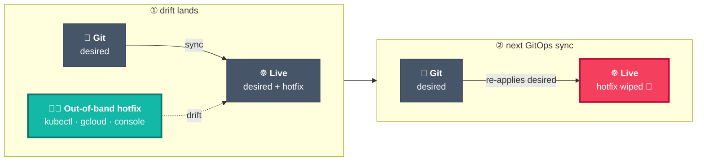
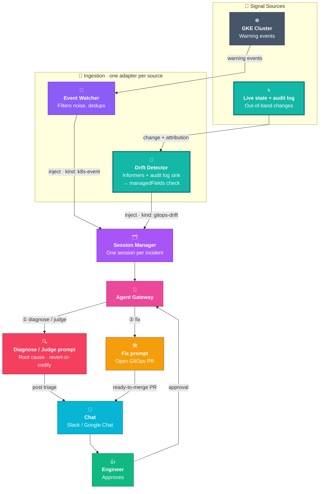

# kube-agents Drift Detection

> **STATUS — design of record; not yet implemented.** No code in this repository detects drift today: there is no Drift Detector adapter and nothing emits a `gitops-drift` inject. The pipeline this design plugs into — session, agent, chat, approval, GitOps PR — does ship, and is described in [`agents/platform/docs/session_management.md`](../../agents/platform/docs/session_management.md). Treat everything below as the reference design, not as shipped behaviour.

**Drift** = a cluster's live state no longer matches what Git (the GitOps source of truth) says it should be, usually from out-of-band `kubectl`/`gcloud`/console changes during an incident. It matters because it silently breaks **reliability** (hotfixes vanish on next sync), **disaster recovery** (rebuild-from-Git no longer reproduces prod), **security/compliance** (guardrails removed invisibly, running state no longer provably matches approved state), and **fleet consistency**.

Most shops disable auto-heal (reverting a live hotfix mid-incident is dangerous), so someone has to notice each change, judge whether it's safe, and reconcile it manually. That's the gap, and the opportunity.

## The two jobs hiding in "drift detection"

- **Job A: compute the diff** (what's out of sync). Commoditized, mechanical. ArgoCD does it; so does `kubectl diff`, `managedFields`, audit logs. No need to reinvent this; lean on existing procedural code.
- **Job B: judge the diff** (security loosening, forgotten hotfix, or benign controller noise? revert or codify?). ArgoCD does none of this. This is the ambiguous, higher-value work, and where we go beyond ArgoCD.

## How we compute the diff (Job A)

Tool-agnostic, two signals that cover each other:

- **`managedFields`:** every object records which _manager_ owns each field. A field owned by `kubectl`/a console session instead of the GitOps controller is an out-of-band change. This is the field-level "what drifted," read straight off the live object (no GitOps tool required). _Attribution quality depends on Server-Side Apply being in use; where it isn't, we lean on audit logs._
- **Audit logs:** the mutating-call record, with the actual **principal, verb, object, and timestamp**. This is the "who did it, when, from where" that `managedFields` can't give you. Kubernetes audit is not served by the Kubernetes API: on GKE these are Cloud Audit Logs (`log_id("cloudaudit.googleapis.com/activity")`, `protoPayload.serviceName="k8s.io"`), read through a logging sink → Pub/Sub → subscriber. That is the ingestion path `agentplugins/pubsub-platform` already runs for the stockout investigator, so the drift audit signal is another route on that adapter rather than new plumbing — and the GCP requirements (a sink, a topic, a subscription, `roles/pubsub.subscriber`) live here, in this signal, not in the `managedFields` one.

Detection can be **event-driven** (a resource informer or an audit-log subscription fires the moment a change lands) or a **periodic sweep**. Together, `managedFields` says _what fields a non-GitOps actor owns_ and audit logs say _who changed them and when_, giving a complete, attributed diff.

**Where the desired value comes from: Git.** `managedFields` says which fields a non-GitOps manager owns; it does not keep the value those fields held before the change, and neither does the live object. To show a diff or propose a revert, the agent reads the desired manifest out of the GitOps repository — the same clone `submit-suggestion` leases to write the PR, so this is an existing path and not a new dependency.

The MVP takes **no dependency on any GitOps tool**. This baseline works on every cluster and covers resources no tool manages. Argo/Flux is an optional enrichment we add later (see _Future enhancements_), never a prerequisite. **No GitOps tool is not the same as no Git:** Argo and Flux are what we do without; the repository is still the source of desired state. Two cases fall outside that:

- **Rendered manifests.** Where the repo goes through Kustomize or Helm, the file in Git is not the applied object, so the comparison needs a render step first. This is the drift-from-Git long tail the Argo/Flux enrichment covers.
- **Resources not in Git at all.** There is no desired state to revert to, so the only sound proposals are **codify** or **delete** — never revert. CUJ 1's revert-or-codify assumes a Git-managed resource.

## How we judge the diff (Job B)

This is the agent's job, and where the value is. The attributed diff, plus its context (namespace and data sensitivity, whether an incident is active, a matching change ticket, related resources, policy), goes to the agent, which decides:

- **Benign controller noise / expected mutation:** ignore it (the noise filtering that keeps drift usable).
- **Forgotten hotfix that's actually correct:** propose **codifying** it into Git rather than reverting.
- **Security loosening or accidental change:** propose **reverting** to the desired state.

The decision lands as a `gitops-drift` inject into the existing pipeline: session, chat, human approval, then GitOps PR. Same downstream path as every other signal, and nothing touches production without approval.

## Where it fits the pipeline

Drift is **just another signal source.** The Drift Detector is a new ingestion adapter that emits a `gitops-drift` inject; everything downstream (session, agent, chat, approval, GitOps PR) is the pipeline we already run.

> **Legend:** teal (thick border) = the only new pieces drift adds, a source and its adapter. Everything else already ships today.

## Choosing CUJs: the test

Take _"detect an admin patched a LoadBalancer to a public IP and auto-revert it."_ **Not enough:** ArgoCD self-heal reverts it, Gatekeeper/Kyverno _block it at admission_, and it's a crisp rule with an obvious fix (zero judgment); auto-reverting also fights our PR-behind-approval posture.

**The test:** a CUJ earns its place only when the answer needs context a static rule can't hold (data sensitivity, incident state, who/why, combinatorial risk) and the right fix isn't just "revert to Git." Every MVP CUJ below clears that bar.

## Where we start: MVP CUJs

| CUJ                                      | The drift                                                                                       | Agent does                                                                                     | Why it beats Argo/Gatekeeper                                                                                        |
| ---------------------------------------- | ----------------------------------------------------------------------------------------------- | ---------------------------------------------------------------------------------------------- | ------------------------------------------------------------------------------------------------------------------- |
| **1. Security loosening** _(flagship)_   | NetworkPolicy deleted, Service opened to a public IP, or `securityContext` loosened out-of-band | Names the actor, weighs the security impact, recommends **revert or codify** as a PR           | Self-heal reverts blindly (bad if it was an emergency fix); with it off, just `OutOfSync`, no actor and no judgment |
| **2. Emergency hotfix**                  | Mid-incident, someone bumps a limit/replica/timeout directly on the cluster                     | Correlates with the active incident, judges it sound, PRs it to **codify into Git**            | Self-heal reverts the fix and re-triggers the incident, with no concept of "good drift"                             |
| **3. Noise-filtered triage** _(enabler)_ | 40 things "drift," mostly benign controller churn                                               | Filters controller noise via `managedFields`, reports the real human changes in plain language | Argo dumps `OutOfSync: 40` with no actor and no filter, so you drown                                                |
| **4. Unwritten-norm exposure**           | Service in a `data-classification: pii` namespace goes public, **no policy rule forbids it**    | Reasons from data sensitivity + firewall rules, flags high-severity, PRs it back to internal   | No rule fires for Gatekeeper; self-heal reverts with no severity or reasoning                                       |

## Future enhancements

Once the MVP CUJs land:

- **Argo/Flux enrichment:** where the customer runs it, consume its OutOfSync status (skip recomputing the diff) and use its rendered desired state for the drift-from-Git long tail. An adapter that degrades gracefully where absent, never a prerequisite.
- **Cross-domain blast radius:** correlate multiple related drifts (public IP + bypassed NetworkPolicy + loosened `securityContext`) into one exposure finding.
- **Composed privilege escalation:** RBAC that's fine alone but escalates in combination with an existing binding.
