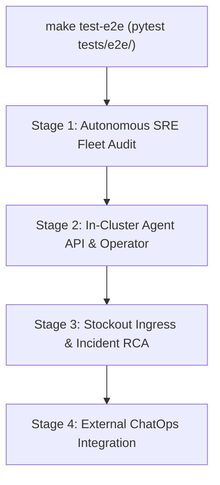

# E2E Testing Harness & Multi-Stage Promotion Gate

> **STATUS — design of record; implemented.** This document defines the architecture, execution model, and scenario matrix of the automated End-to-End (E2E) testing harness across PR CI, Release Candidate (RC) promotion gates, and nightly evaluation pipelines.

---

## 1. Overview and Pipeline Tiers

The `kube-agents` test execution model partitions tests across three distinct automation tiers:

| Tier                            | Trigger                                                                                                                    | Purpose                                                                                               | Execution Target                                                         |
| :------------------------------ | :------------------------------------------------------------------------------------------------------------------------- | :---------------------------------------------------------------------------------------------------- | :----------------------------------------------------------------------- |
| **Tier 1: PR CI**               | Pull Request (`pull_request`)                                                                                              | Fast, offline unit and structural validation on every change                                          | `make test-python`, `make validate`, `make docs-check`                   |
| **Tier 2: RC Promotion Gate**   | Release Candidate build (`rc-release-pipeline.yml`)                                                                        | Validates candidate container images on a freshly provisioned GKE cluster before tagging `_validated` | `make test-e2e` (`scripts/release/execute_e2e_tests.py`)                 |
| **Tier 3: Nightly & On-Demand** | Manual dispatch only today (`nightly-pipeline.yml`, `e2e-manual-runner.yml`) — the nightly pipeline has no `schedule:` yet | Full matrix across multi-cluster environments, audit streams, and GPU/scarcity stockout scenarios     | `make test-e2e` with `FLEET_AUDIT_STREAMS=all`, `STOCKOUT_SCENARIOS=all` |

Tier 2's "freshly provisioned" is the intent. What the pipeline does today, and why it differs,
is in [`scripts/release/README.md`](../../scripts/release/README.md).

---

## 2. The 4-Stage E2E Test Pipeline

The end-to-end test suite in `tests/e2e/` runs as a sequential, multi-stage pipeline against a running GKE cluster:



### Stage 1: Autonomous SRE Fleet Audit (`test_agent_fleet_audit.py`)

Validates credential isolation, GitHub authentication, and audit watchdog capabilities:

- **GitHub Token Minter Credential Isolation**: Verifies that raw GitHub App private keys (`github-app-credentials`, `github-app-private-key`) are never mounted or injected into container deployment specs in the agent namespace.
- **In-Pod GitHub Authentication & Connectivity**: Executes read-only token refresh via the credential proxy broker inside the agent pod and verifies repository access (`gh api repos/<target_repo>`).
- **Fleet Audit Stream Dispatch**: Exercises fleet audit stream ledger rendering, schema validation, and GitHub API lifecycle across configured streams (`FLEET_AUDIT_STREAMS=all`).

### Stage 2: In-Cluster Agent API & Operator Reconciliation (`test_agent_api_health.py`, `operator/agentplugins_e2e_test.py`)

Verifies core platform agent responsiveness and Kubernetes operator controller reconciliation:

- **Direct Agent API Health**: Sends a REST probe to `/v1/responses` to verify agent process readiness and JSON schema response handling. The probe reaches the credential-proxy sidecar through a `kubectl exec` relay (`scripts/exec_tunnel.py`), not `kubectl port-forward`: on a GKE Sandbox (gVisor) node pool the kubelet sets a forward up in the host-side netns and cannot see a listener inside the sandbox, so every port on the pod refuses the connection. [`platformagent-crd.md`](../site/src/content/docs/operator/platformagent-crd.md) is canonical on that constraint.
- **Operator Plugin Reconciliation**: Deploys `AgentPlugin` Custom Resources to verify the Kubebuilder operator controller mounts plugin volumes into `platform-agent` pods and cleanly cleans up on CR deletion.

### Stage 3: Stockout Ingress & Incident Scenarios (`test_stockout_investigation.py`)

Validates the full incident investigation loop from alert ingestion to GitOps PR creation:

- **Pub/Sub Alert Ingress**: Emits synthetic autoscaler stockout alerts to Pub/Sub to confirm agent ingress and deduplication.
- **Live CPU Stockout Investigation (Scenario 04)**: Deploys an unschedulable CPU workload, triggers root-cause investigation, and asserts the agent identifies the missing zone and proposes the correct GitOps remediation PR (Executed in RC promotion gate).
- **The Other Nine Failure Modes (Scenarios 01-03, 05-10)**: Exercises regional scarcity, quota limits, volume incompatibility, and false signals. Reached through the nightly and manual matrices, which set `STOCKOUT_SCENARIOS: "all"` and so run scenario 04 alongside them rather than instead of them.

### Stage 4: External ChatOps Integration (`gchat_agent_test.py`)

Exercises bidirectional communication through Google Chat:

- Posts a structured test message to the configured Google Chat Space via GCP Pub/Sub and verifies the agent returns the expected calculation or status response.
- Automatically skips if Google Chat credentials are unconfigured in the execution environment.

---

## 3. Stockout Scenarios Matrix

The stockout investigator test harness in `agentplugins/gke-stockout-investigator/scenarios/` covers 10 failure modes:

| Scenario                          | Mode / Failure Condition                                 |      Scope in RC Gate       | Scope in Nightly / Manual Matrix |
| :-------------------------------- | :------------------------------------------------------- | :-------------------------: | :------------------------------: |
| `01-gpu-regional-scarcity`        | L4 GPUs exhausted in workload's permitted zone           | Skipped (requires GPU pool) |   ✅ (`STOCKOUT_SCENARIOS=01`)   |
| `02-gpu-quota-exceeded`           | GPUs requested against smaller regional quota            | Skipped (requires GPU pool) |   ✅ (`STOCKOUT_SCENARIOS=02`)   |
| `03-large-vm-shape-scarcity`      | Pinned to c3-standard-176 shape                          |  Skipped (heavy resource)   |   ✅ (`STOCKOUT_SCENARIOS=03`)   |
| `04-missing-zone-fallback`        | Pod unschedulable due to single-zone compute constraints |    ✅ **Executed in RC**    |                ✅                |
| `05-missing-ondemand-floor`       | ComputeClass priority is Spot with no on-demand floor    |           Skipped           |   ✅ (`STOCKOUT_SCENARIOS=05`)   |
| `06-stateful-disk-generation-mix` | Volume type attaches on some generations, not others     |           Skipped           |   ✅ (`STOCKOUT_SCENARIOS=06`)   |
| `07-hyperdisk-incompatibility`    | Hyperdisk on class offering only pre-Hyperdisk families  |           Skipped           |   ✅ (`STOCKOUT_SCENARIOS=07`)   |
| `08-ccc-priority-starvation`      | Over-granular priority list causing autoscaler loop      |           Skipped           |   ✅ (`STOCKOUT_SCENARIOS=08`)   |
| `09-duplicate-signal`             | Same alert three times: dedup & duplicate-PR suppression |           Skipped           |   ✅ (`STOCKOUT_SCENARIOS=09`)   |
| `10-false-signal`                 | Alert for healthy workload; agent stands down            |           Skipped           |   ✅ (`STOCKOUT_SCENARIOS=10`)   |

---

## 4. Test Execution & Environment Contract

The test runner `scripts/release/execute_e2e_tests.py` reads configuration from `tests/e2e/e2e_config.yaml` and environment variables:

| Variable              | Description                               | Default             |
| :-------------------- | :---------------------------------------- | :------------------ |
| `GCP_PROJECT_ID`      | Target Google Cloud Project ID            | None (required)     |
| `GKE_CLUSTER_NAME`    | Target GKE cluster name                   | None (required)     |
| `GCP_REGION`          | Target cluster region                     | `us-central1`       |
| `STOCKOUT_SCENARIOS`  | Comma-separated scenario numbers or `all` | `04`                |
| `FLEET_AUDIT_STREAMS` | Specific audit stream names or `all`      | `all`               |
| `E2E_SUITE`           | Target suite selector                     | `gchat`             |
| `E2E_ENV`             | Deprecated alias for `E2E_SUITE`          | Unset               |
| `GITHUB_ORG`          | Owner used to qualify `GITHUB_REPO`       | Config `env_vars`\* |
| `GITHUB_REPO`         | Repository the GitHub probes target       | Config `env_vars`\* |

\* Except on `rc` and `nightly`, which set neither in `e2e_config.yaml`. There
the pair comes from the bound environment's `GITOPS_ORG` and `GITOPS_REPO`, which
`e2e-run.yml` passes to the suite and `deploy-environment.yml` passes to
the installer — one source of truth for the repository the minter is scoped to and the
repository the probe reads back, because a token minted for one does not authenticate
against another. With those unset, the `github_repo` fixture falls through to the
repository the cluster was installed with, read from `platform-agent-settings`.

The last two are read by the fixtures in `tests/e2e/conftest.py` rather than by the
runner, which forwards the environment to pytest unchanged. `GITHUB_REPO` is required —
`test_agent_fleet_audit.py` fails rather than skips without it. `GITHUB_ORG` is
optional, and is only cross-checked against the owner the repository resolves to; where
it is unset, the fixture takes it from that owner.

The suites' `GITHUB_REPO` resolves to `owner/repo`: `test_agent_fleet_audit.py` asserts
that shape and `agents/platform/scripts/github_token_refresh.py` refuses anything else.
A bare repository name is accepted and qualified with `GITHUB_ORG`, because the CI
variable behind it is bare — `vars.GH_REPO` for the deploy workflows, which pass it to
the GitHub Token Minter alongside `vars.GH_ORG` rather than combined with it, and
`vars.GITOPS_REPO` with `vars.GITOPS_ORG` wherever `e2e-run.yml` or `e2e-manual-runner.yml` runs a suite, per the footnote above. That is the
same spelling with a different meaning: the Token Minter's `GITHUB_REPO`
([install variables](../site/src/content/docs/deploy/token-minter.md)) is the bare name,
and only the E2E suites' one is the qualified form.

### Test Environments

The test harness provides modular and composite environments configured in `tests/e2e/e2e_config.yaml`:

| Environment      | Description                                                                                            | Included Test Suites                                                                                                                                  |
| :--------------- | :----------------------------------------------------------------------------------------------------- | :---------------------------------------------------------------------------------------------------------------------------------------------------- |
| `rc`             | Release Candidate promotion gate: Agent API health, audit ledger, and fast stockout RCA (Scenario 04)  | `test_agent_api_health.py`, `test_agent_fleet_audit.py`, `test_stockout_investigation.py`                                                             |
| `nightly`        | Full Nightly Matrix: all audit streams, all stockout scenarios, operator plugins, and chat integration | `test_agent_api_health.py`, `test_agent_fleet_audit.py`, `test_stockout_investigation.py`, `operator/agentplugins_e2e_test.py`, `gchat_agent_test.py` |
| `investigations` | In-cluster Agent API health and stockout alert investigation scenarios                                 | `test_agent_api_health.py`, `test_stockout_investigation.py`                                                                                          |
| `audit`          | Fleet SRE audit ledger generation, credential isolation, and stream evaluation                         | `test_agent_api_health.py`, `test_agent_fleet_audit.py`                                                                                               |
| `agent-plugin`   | Operator AgentPlugin CR lifecycle and Hermes overlay reconciliation                                    | `operator/agentplugins_e2e_test.py`                                                                                                                   |
| `gchat`          | Live Google Chat integration and Pub/Sub messaging                                                     | `gchat_agent_test.py`                                                                                                                                 |

### Running Locally

```bash
# Set cluster context and run default investigation E2E suite
export GCP_PROJECT_ID="my-gcp-project"
export GKE_CLUSTER_NAME="my-cluster"
make test-e2e
```

The stockout suite waits for its AgentPlugin to reach Ready, for the gateway to finish
rolling, and for the plugin's `SKILL.md` to be readable inside the surviving pod before
the first scenario runs. A failure in any of those ends the module naming what was wrong
rather than letting each scenario spend its watch timeout. The plugin is installed only
when its custom resource is absent, so the suite needs the permissions that
[`agentplugins/README.md`](../../agentplugins/README.md#installing) lists only on a
cluster that has never had it.
