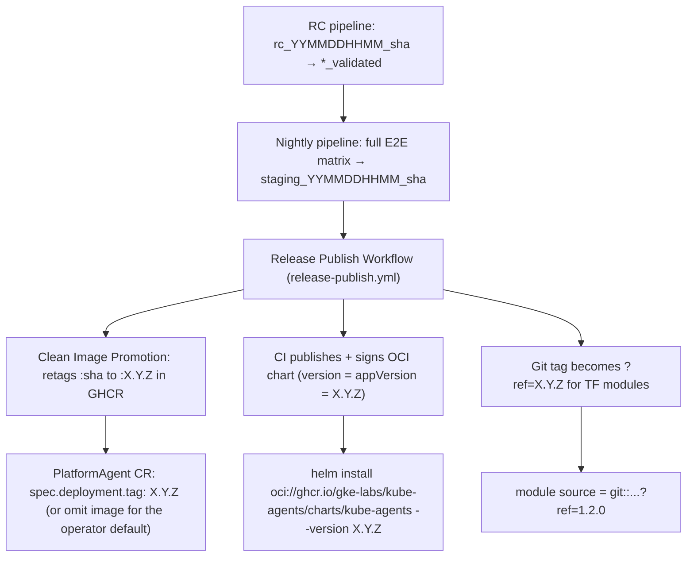

# Design: SemVer Deployment, Infrastructure & Operational Playbook Versioning

**Status:** Implemented (with deliberate exceptions listed in §5)
**Date:** 2026-07-31

---

## 1. Purpose

`kube-agents` development flows deploy from commit SHAs and the `:latest` tag across
container images, Kubernetes manifests, operator defaults, and scripts. That is right for
fast iteration and wrong for production GitOps, which needs immutable, comparable versions.
This design adopts **Semantic Versioning (SemVer 2.0.0)** for every production deployment
artifact: container images, the Helm chart, Terraform modules, and the release
documentation and governance playbooks around them.

## 2. Design decisions

1. **OCI registry for Helm charts, not a traditional chart repository.** The chart is
   published as an OCI artifact to GHCR (`oci://ghcr.io/gke-labs/kube-agents/charts/kube-agents`)
   by `release-publish.yml` (`publish_helm_chart.sh`), reusing existing GHCR auth and storage. The chart `version` tracks `appVersion`: the
   workflow packages with both set from the release version, so there is no independent chart-only
   release train.
2. **Terraform modules sourced by Git release tag.** Reusable modules live under
   `terraform/modules/<module-name>/` and consumers pin them with
   `git::https://github.com/gke-labs/kube-agents.git//terraform/modules/<module-name>?ref=1.2.0`,
   avoiding a separate module-registry backend.
3. **The staging rung feeds SemVer promotion.** Pre-release validation keeps using RC tags
   (`rc_YYMMDDHHMM_<short_sha>`, `*_validated` on success), and the nightly pipeline promotes a
   validated candidate that passes the full E2E matrix to `staging_YYMMDDHHMM_<short_sha>`. That
   staging tag is what a GA release is gated on — see `scripts/release/README.md`.
4. **GA release pipeline creates stamped release child commit.** When promoting a staging-promoted
   candidate, `release-publish.yml` creates a single-parent child commit on detached HEAD
   (baking `BAKED_RELEASE_VERSION` into installer scripts), tags it `MAJOR.MINOR.PATCH` (`X.Y.Z`),
   and orchestrates clean image promotion and chart publication. Because the GA tag points at this
   stamped child commit outside `main`, `git log main` does not show the release commit and
   `git describe --tags` on `main` does not resolve to the GA tag (which is why `default_image_tag`
   matches numeric SemVer tags explicitly). Git tag resolution for Terraform module consumption
   (`?ref=X.Y.Z`) remains unaffected.
5. **The operator defaults to its own release version.** When a `PlatformAgent` CR omits
   `spec.deployment.image`, the operator dynamically derives the matching versioned agent image
   from its own container image at runtime (or via `OPERATOR_IMAGE` env var). Precedence:
   CR spec > `PLATFORM_AGENT_IMAGE` env > `OPERATOR_IMAGE` (dynamic runtime derivation) > `latest` fallback.

## 3. What ships

| Artifact             | Mechanism                                                                                                                                                                                                                                                                     |
| :------------------- | :---------------------------------------------------------------------------------------------------------------------------------------------------------------------------------------------------------------------------------------------------------------------------- |
| Container images     | Built once on push to `main` (tagged with commit SHA and `:latest`). Clean Promotion (`release-publish.yml` / `promote_release_images.sh`) promotes verified images to `X.Y.Z` without rebuilding.                                                                            |
| Operator default tag | Dynamic runtime derivation from running operator container image / `OPERATOR_IMAGE` env var (with `DefaultPlatformAgentVersion` for local development fallback).                                                                                                              |
| Helm chart           | `charts/kube-agents/` (CRDs, operator, PlatformAgent CR), packaged with version = appVersion = tag, published and cosign-signed by digest via `release-publish.yml` (`publish_helm_chart.sh`).                                                                                |
| Terraform modules    | `terraform/modules/{gke-cluster,kube-agents-iam,chat-pubsub,github-minter,drift-pubsub}/`, consumed via `?ref=1.2.0`; `terraform/examples/full-install/` composes the first four plus the chart into one apply (`drift-pubsub` is tagged and consumable but not yet composed) |
| Release guide        | [Release versioning & promotion](../site/src/content/docs/deploy/release-versioning.md)                                                                                                                                                                                       |
| Governance           | `standardization_validator_sop.md` Rule 3 (immutable-tag compliance); pre-release artifact checks live in CI (`validate.yml` and the RC pipeline), not in an agent SOP                                                                                                        |

## 4. Version flow

## 5. Deliberate exceptions and known gaps

- **Development flows keep `latest`.** `k8s-operator/config/manager/kustomization.yaml`
  still sets `newTag: latest` and `k8s-operator/scripts/common.sh` still offers `latest`
  as the default `IMAGE_TAG` — both serve the interactive/dev install path, not GitOps
  production deploys. Rule 3 of the standardization validator is what guards production
  namespaces.
- **User-supplied untagged images fall back to `latest`, not the injected version.** The
  operator deliberately does not stamp its own release version onto third-party image
  repositories (`resolveAgentImage`).
- **`imagePullPolicy` is static.** Deciding pull policy dynamically from tag shape
  (SemVer → `IfNotPresent`, mutable → `Always`) was considered and not implemented; the
  chart and templates set explicit values instead.
- **No chart lint rule forbids `:latest`.** Chart defaults simply never produce it;
  enforcement in rendered workloads comes from the governance SOP, not `helm lint`.
