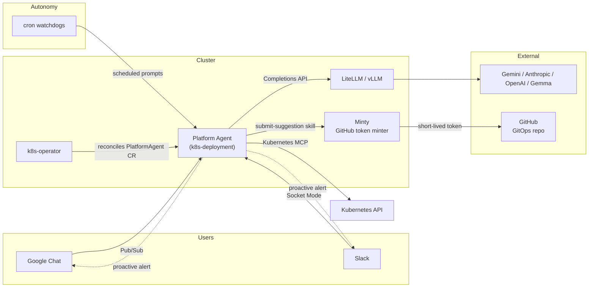

import { Aside, CardGrid, LinkCard } from "@astrojs/starlight/components";

## What it is

`kube-agents` runs an autonomous Platform Agent inside your Kubernetes cluster. It listens on Google Chat (and optionally Slack), executes a growing library of Kubernetes skills on demand, and on its own schedule runs background watchdogs that audit the fleet, propose fixes as GitHub pull requests, and post proactive alerts back to Chat.

It ships as a small set of components:

- A **Kubernetes operator** (`k8s-operator`, Go / Kubebuilder) that reconciles a `PlatformAgent` custom resource.
- A **Platform Agent** Deployment (running the [Hermes runtime](https://github.com/NousResearch/hermes-agent), `nousresearch/hermes-agent`) with an opinionated persona, an MCP-based Kubernetes toolset, and a library of skills.
- An **inference gateway** — [LiteLLM](https://litellm.ai) for hosted models (Gemini, Anthropic, OpenAI) or [vLLM](https://vllm.ai) for local models on GPU nodes.

<Aside type="note">
  Today's shipping skills, provisioning scripts, and MCP integrations target
  GKE. The Platform Agent architecture — the agent Deployment, operator,
  inference gateway, ChatOps ingress — is not GKE-specific and can extend to
  other Kubernetes distributions as skills and toolsets are added.
</Aside>

## Two ways to think about it

<CardGrid>
  <LinkCard
    title="Proactive autonomy"
    description="Scheduled watchdogs (blueprint sync, compliance audit, security patches, cost analysis, capacity orchestration…) run without prompting. Findings become GitOps PRs and Chat alerts."
    href="/kube-agents/overview/proactive-autonomy/"
  />
  <LinkCard
    title="ChatOps interface"
    description="Ask the Platform Agent things in Google Chat or Slack. It runs skills, inspects clusters through the Kubernetes MCP server, and reports back."
    href="/kube-agents/concepts/chatops/"
  />
</CardGrid>

## What the agent can do out of the box

A growing library of skills ships in `agents/platform/skills/`. Full [skill catalog](/kube-agents/skills/) has descriptions and source links.

| Group                     | Skills                                                                             |
| ------------------------- | ---------------------------------------------------------------------------------- |
| Cluster lifecycle         | `gke-cluster-creator`, `gke-cluster-lifecycle`, `gke-multi-tenancy`                |
| Workloads                 | `gke-app-onboarding`, `gke-workload-scaling`, `gke-workload-troubleshooting`       |
| Cost and capacity         | `gke-cost-analysis`, `gke-compute-classes`, `gke-productionize`, `gke-reliability` |
| Security and compliance   | `gke-workload-security`, `gke-backup-dr`                                           |
| Networking and storage    | `gke-networking-edge`, `gke-storage`                                               |
| AI and inference          | `gke-inference-quickstart`                                                         |
| Observability             | `gke-observability`, `kube-agents-observability`                                   |
| Manifests and remediation | `gke-manifest-generation`, `submit-suggestion`                                     |
| Meta                      | `github-issue-resolver`                                                            |

## Architecture at a glance



Full walkthrough on the [Architecture](/kube-agents/overview/architecture/) page.

## Install

Today the working install path is GKE via the provisioning script. Helm and Kind (for non-GKE clusters) are planned — see [PR #353](https://github.com/gke-labs/kube-agents/pull/353).

```bash
git clone https://github.com/gke-labs/kube-agents.git
cd kube-agents/k8s-operator/scripts
./provision.sh
```

The script bootstraps a GKE Standard cluster, the operator CRDs, IAM bindings, Google Chat Pub/Sub, Kubernetes secrets, and the Platform Agent itself. See the [Quick start](/kube-agents/install/quickstart-gke/) for a step-by-step breakdown.

## Disclaimer

This is not an officially supported Google product.
