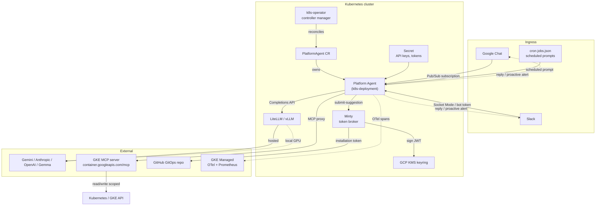

import { Aside } from "@astrojs/starlight/components";

Ingress paths converge on the Platform Agent pod: user chat, scheduled cron, and the operator itself.

## Component map

## The request flows

### 1. Chat request → reply

<Aside type="note">
  Google Chat is fully wired and end-to-end tested. Slack is opt-in via
  `SLACK_ENABLED=true` during provisioning; see
  [ChatOps](/kube-agents/concepts/chatops/).
</Aside>

1. A user posts in a Google Chat space (or DMs the Slack app).
2. Google Chat publishes the event to a Pub/Sub topic; Slack routes via Socket Mode. `provision_05_gcp_gchat.sh` sets up the topic and subscription.
3. The Platform Agent pod consumes the event via its `platform_control` MCP server.
4. Hermes runs a tool-calling loop: system prompt (`SOUL.md`) + user message + available tools. It picks skills to load and MCP tools to call.
5. Cluster reads go through the `gke` MCP server; mutations that touch infra route through the `submit-suggestion` skill (see flow 3) rather than direct `kubectl`.
6. The reply is posted back to the same Chat thread. Long operations return a summary; console links use the templates in `SOUL.md §6`.

### 2. Cron tick → autonomous run

1. The Hermes runtime evaluates `agents/platform/cron/jobs.json` on schedule.
2. Each firing sends the pre-authored `prompt` (usually "read `/opt/defaults/governance/<sop>.md` and execute") to the Platform Agent as a synthetic message.
3. The agent reads the SOP, executes the diagnostic queries, produces findings.
4. If the SOP says "propose a remediation", flow 3 runs; if it says "notify", the agent posts to the configured Chat channel.

### 3. Remediation → GitHub PR

1. The agent invokes `submit-suggestion` with a proposed diff (usually a YAML patch generated from an SOP).
2. `submit-suggestion` writes the file(s), commits to a topic branch, and calls Minty for a signed installation token.
3. Minty signs a JWT with a KMS-held private key and exchanges it for a short-lived GitHub App token.
4. `submit-suggestion` pushes the branch and opens a PR against the configured GitOps repo.
5. The agent posts a Chat message with the PR link.

## Deployment topology

Everything except the LLM (and, for hosted providers, the LLM API endpoint) runs inside your Kubernetes cluster:

- **Namespace**: `kubeagents-system` (renamed from earlier `platform-agent-system` in PR #336).
- **Node pools**: default node pool is enough for the operator, Platform Agent, LiteLLM, and Minty. If you use vLLM, provision a GPU node pool separately.
- **Optional gVisor node pool** for sandboxed skill execution (`provision_02_gvisor_nodepool.sh`, opt-in via `ENABLE_GVISOR=true`).
- **Workload Identity** bindings are pre-provisioned in `provision_04_gcp_iam.sh` — the operator gets cluster management scope, the Platform Agent gets a configurable permission set (`read-only`, `gke-admin`, or `custom`).

## Failure modes worth knowing

- **LLM outage.** LiteLLM proxies retries and can fall back to a secondary provider if configured. `SOUL.md §5` retries via the recovery ladder; the agent will report the failure in Chat rather than hang.
- **Cron overlap.** Long-running watchdogs (e.g. `security-patch-orchestrator`) can overlap with hourly jobs. Hermes serializes messages per session; overlap manifests as queueing, not concurrency.
- **Minty token exhaustion.** GitHub App installation tokens are 1-hour scoped. Minty caches and re-mints as needed; if the token refresher fails, `submit-suggestion` will surface it and route through the recovery ladder.
- **Pub/Sub subscription drift.** If the GChat Pub/Sub subscription is deleted out of band, no chat messages arrive and no error surfaces automatically. Cron-driven runs still work, and the `kube-agents-observability` skill helps triage.

## Where to go next

- [Platform Agent](/kube-agents/concepts/platform-agent/) — the persona, safety rails, and MCP wiring.
- [ChatOps](/kube-agents/concepts/chatops/) — Google Chat and Slack ingress details.
- [Declarative workflow](/kube-agents/concepts/declarative-workflow/) — how PR-based remediation is enforced.
