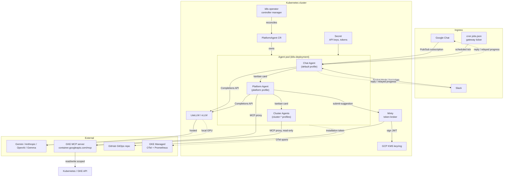

import { Aside } from "@astrojs/starlight/components";

Ingress paths converge on the agent pod: user chat, scheduled cron, and the operator itself. Inside the pod, one Hermes gateway hosts co-located profiles: the **Chat Agent** (the `default` profile — the conversational front door and the only chat ingress), the **Platform Agent** (the `platform` profile — the privileged specialist that does the infrastructure work), and read-only per-cluster **[Cluster Agents](/kube-agents/concepts/cluster-agents/)** (`cluster-*` profiles the Platform Agent scaffolds, one per managed GKE cluster). They coordinate through a shared kanban board: the Chat Agent files a card, the gateway's dispatcher spawns the assigned specialist as a worker, and the completion is relayed back into the originating chat thread.

## Component map

```mermaid
flowchart TB
    subgraph Ingress
        GC[Google Chat]
        SL[Slack]
        CR[cron jobs.json<br/>gateway ticker]
    end

    subgraph Cluster["Kubernetes cluster"]
        OP[k8s-operator<br/>controller manager]
        CRD[PlatformAgent CR]
        subgraph Pod["Agent pod (k8s-deployment)"]
            CA["Chat Agent<br/>(default profile)"]
            PA["Platform Agent<br/>(platform profile)"]
            CL["Cluster Agents<br/>(cluster-* profiles)"]
        end
        SEC[Secret<br/>API keys, tokens]
        LM[LiteLLM / vLLM]
        MT[Minty<br/>token broker]
        KMS[GCP KMS keyring]
    end

    subgraph External
        LLM[Gemini / Anthropic / OpenAI / Gemma]
        MCPGKE[GKE MCP server<br/>container.googleapis.com/mcp]
        GH[GitHub GitOps repo]
        OTEL[GKE Managed<br/>OTel + Prometheus]
    end

    GC -->|Pub/Sub subscription| CA
    SL -->|Socket Mode / bot token| CA
    CR -->|scheduled tick| CA

    CA -->|kanban card| PA
    PA -->|kanban card| CL

    OP -->|reconciles| CRD
    CRD -->|owns| Pod
    SEC --> Pod

    CA -->|Completions API| LM
    PA -->|Completions API| LM
    LM -->|hosted| LLM
    LM -.->|local GPU| LLM

    PA -->|MCP proxy| MCPGKE
    CL -->|MCP proxy, read-only| MCPGKE
    MCPGKE -->|read/write scoped| K8S[Kubernetes / GKE API]

    PA -->|submit-suggestion| MT
    MT -->|sign JWT| KMS
    MT -->|installation token| GH

    Pod -.->|OTel spans| OTEL
    CA -.->|reply / relayed progress| GC
    CA -.->|reply / relayed progress| SL
```

## The request flows

### 1. Chat request → reply

<Aside type="note">
  Google Chat is fully wired and end-to-end tested. Slack is opt-in via
  `SLACK_ENABLED=true` during provisioning; see
  [ChatOps](/kube-agents/concepts/chatops/).
</Aside>

1. A user posts in a Google Chat space (or DMs the Slack app).
2. Google Chat publishes the event to a Pub/Sub topic; Slack routes via Socket Mode. `provision_05_gcp_gchat.sh` sets up the topic and subscription.
3. The **Chat Agent** (the pod's `default` Hermes profile, image `nousresearch/hermes-agent`) consumes the event through Hermes' bundled Google Chat adapter, patched for credential-free operation by `google_chat_relay_patch.py` (Slack uses `slack_relay_patch.py` in Socket Mode).
4. The Chat Agent holds no infrastructure tools. It discovers the available specialists via its `router` MCP tool (`list_agents`, descriptions from each agent's `CAPABILITIES.md`) and files a kanban card with the full request context (`kanban_create`); the originating chat session is auto-subscribed to the card.
5. The gateway's kanban dispatcher spawns the **Platform Agent** (`hermes -p platform chat -q "work kanban task <id>"`), which runs the tool-calling loop: system prompt (`SOUL.md`) + card body + available tools. Cluster reads go through the `gke` MCP server; mutations that touch infra route through the `submit-suggestion` skill (see flow 3) rather than direct `kubectl`. Work scoped to one cluster's live runtime is delegated onward as a nested kanban card to that cluster's read-only [Cluster Agent](/kube-agents/concepts/cluster-agents/) (`SOUL.md §6`).
6. The worker's `kanban_complete` — its one-line `summary` followed by its full `result` — posts back into the same Chat thread, plus one message for each staged sub-card completion along the way. The gateway delivers those directly rather than through the Chat Agent, so the answer arrives verbatim. Console links are built from the shared templates in `agents/platform/docs/gcp-console-links.md` (per `SOUL.md §5`).

### 2. Cron tick → autonomous run

1. The Chat Agent profile's gateway — the only ticking one, since cron ticking belongs to a running gateway — evaluates its own `jobs.json` on schedule. Its `profile-cron-tick` job runs `hermes cron tick` against every named profile with work due, once a minute, which is what makes the Platform Agent's own roster live (see [What fires the schedule](/kube-agents/concepts/autonomous-watchdogs/#what-fires-the-schedule)).
2. The governance watchdogs live on that roster, `agents/platform/cron/jobs.json`. A due one runs in its own process with the Platform Agent's persona, toolsets, `skills` and `max_turns` — no kanban card involved. The prompt is usually "read `governance/<sop>.md` in your profile home and execute"; the path is relative to the profile home, where `profile_scaffold.py` overlays the baked `/opt/platform-template/governance/` directory.
3. The agent reads the SOP, executes the diagnostic queries, produces findings.
4. The six fleet audits hand their findings to the `fleet-audit` skill, which renders and maintains one GitHub **issue** per audit stream — the ledger — and promotes findings with a mergeable manifest into narrow per-finding remediation PRs linked back to it. A run with no findings closes the ledger as completed and returns `[SILENT]` — unless it could not read the whole fleet, in which case the ledger stays open and the gaps are reported, or it resolved findings on the way, in which case it says what closed.

The Chat Agent profile's own job file — [`agents/chat/defaults/cron/jobs.json`](https://github.com/gke-labs/kube-agents/blob/main/agents/chat/defaults/cron/jobs.json) — holds nothing but `no_agent` script jobs: plain subprocesses, no LLM turn, since that profile's toolsets are stripped to `mcp-router`, `kanban` and `memory`. Four ship: `profile-cron-tick` above; the hourly `cluster-agent-reconcile` sweep that keeps Cluster Agent profiles aligned with the live GKE fleet; and the `bootstrap-inventory-scan` / `bootstrap-inventory-delivery` pair behind [first-run onboarding](/kube-agents/concepts/chatops/#first-run-onboarding).

### 3. Remediation → GitHub PR

1. The agent invokes `submit-suggestion` with a proposed diff (usually a YAML patch generated from an SOP).
2. `submit-suggestion` writes the file(s), commits to a topic branch, and calls Minty for a signed installation token.
3. Minty signs a JWT with a KMS-held private key and exchanges it for a short-lived GitHub App token.
4. `submit-suggestion` pushes the branch and opens a PR against the configured GitOps repo.
5. The agent posts a Chat message with the PR link.

## Deployment topology

Everything except the LLM (and, for hosted providers, the LLM API endpoint) runs inside your Kubernetes cluster:

- **Namespace**: `kubeagents-system`.
- **Node pools**: default node pool is enough for the operator, Platform Agent, LiteLLM, and Minty. If you use vLLM, provision a GPU node pool separately.
- **Optional gVisor node pool** for sandboxed skill execution (`provision_02_gvisor_nodepool.sh`, opt-in via `ENABLE_GVISOR=true`).
- **Workload Identity** bindings are pre-provisioned in `provision_04_gcp_iam.sh` — the operator gets cluster management scope, the Platform Agent gets a configurable permission set (`read-only`, `gke-admin`, or `custom`). See [Security & IAM](/kube-agents/reference/security-and-iam/).

### Capacity and isolation

The hub footprint (operator, Platform Agent, LiteLLM, Minty) is small and roughly fixed — it doesn't grow with the number of clusters the agent manages, since those are read remotely through the GKE MCP server. What actually drives node capacity:

- **vLLM.** Local inference needs a GPU node pool; hosted LiteLLM does not.
- **gVisor.** Sandboxed skill execution runs the agent pod on the optional `gvisor-pool` (`ENABLE_GVISOR=true`).

For production, prefer a **dedicated cluster** for the harness. The agent GSA can hold broad GKE permissions in the `gke-admin` set, so a hard cluster boundary limits blast radius if the execution sandbox is ever compromised. A shared cluster (with the `kubeagents-system` namespace for logical isolation) is fine for development.

## Failure modes worth knowing

- **LLM outage.** LiteLLM proxies retries and can fall back to a secondary provider if configured. `SOUL.md §4` retries via the recovery ladder; the agent will report the failure in Chat rather than hang.
- **Silent kanban workers.** A delegated card only reaches the chat thread on completion or block. The Platform Agent is instructed (`SOUL.md §0`) to stage long jobs into scoped sub-cards and propagate the chat subscription onto each so progress stays visible; a worker that exits without `kanban_complete`/`kanban_block` fails the task.
- **Cron overlap.** A long-running fleet audit can still be going when the next job fires — the audit schedules are staggered by 30 minutes, and `github-issue-resolver` runs every 30 minutes regardless. Hermes serializes messages per session, so overlap manifests as queueing, not concurrency.
- **Minty token exhaustion.** GitHub App installation tokens are 1-hour scoped. Minty caches and re-mints as needed; if the token refresher fails, `submit-suggestion` will surface it and route through the recovery ladder.
- **Pub/Sub subscription drift.** If the GChat Pub/Sub subscription is deleted out of band, no chat messages reach the Chat Agent and no error surfaces automatically. Cron-driven runs still work, and the `kube-agents-observability` skill helps triage.

## Where to go next

- [Platform Agent](/kube-agents/concepts/platform-agent/) — the persona, safety rails, and MCP wiring.
- [ChatOps](/kube-agents/concepts/chatops/) — Google Chat and Slack ingress details.
- [Declarative workflow](/kube-agents/concepts/declarative-workflow/) — how PR-based remediation is enforced.
- [`docs/designs/agent-communication.md`](https://github.com/gke-labs/kube-agents/blob/main/docs/designs/agent-communication.md) — the design of record for inter-agent coordination (kanban delegation today; a file-based handover channel as the proposed next step).
