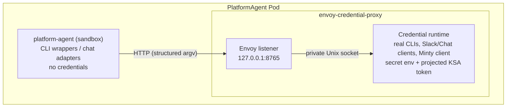

The PlatformAgent sandbox container never receives API keys, access tokens, refresh tokens, or Kubernetes ServiceAccount tokens through its environment or filesystem. Credentials live exclusively in a trusted **Envoy credential-proxy sidecar** inside the same Pod, and the sandbox reaches credentialed capabilities only through a policy-enforced local proxy.

This page summarizes the architecture. The canonical design — including scope, deny-policy details, migration steps, and CI verification assertions — is [`docs/credential-isolation-design.md`](https://github.com/gke-labs/kube-agents/blob/main/docs/credential-isolation-design.md).

## Pod anatomy

Each PlatformAgent runs as one long-lived Pod with these managed containers:

| Container                  | Trust level | Role                                                                                                                                                |
| -------------------------- | ----------- | --------------------------------------------------------------------------------------------------------------------------------------------------- |
| `platform-agent`           | Untrusted   | The agent sandbox — credential-free env and mounts, CLI wrappers.                                                                                   |
| `envoy-credential-proxy`   | Trusted     | Envoy, the credentialed command and chat runtime, and the event watcher, which forwards cluster events using its own separate Kubernetes-API token. |
| `fluent-bit`               | Trusted     | Log forwarding.                                                                                                                                     |
| `platform-agent-dashboard` | Untrusted   | Optional local dashboard (also credential-free).                                                                                                    |



The sandbox image contains only **wrapper binaries** for `gcloud`, `kubectl`, `gh`, and `git`. A wrapper sends the executable name and argument array to Envoy at `127.0.0.1:8765`; the credential runtime executes the corresponding real CLI and returns output and exit status. It never evaluates an agent-supplied shell command, and the runtime's Unix socket is mounted only in the sidecar, so the sandbox cannot bypass Envoy. The real credential-aware CLIs ship in a separate `credential-proxy` image that the sandbox never runs.

**The sandbox environment does not cross the boundary.** The command runs with an environment the sidecar builds itself, so exporting a variable in the agent shell has no effect on the proxied process. Two values are carried explicitly in the request instead, and both must resolve inside the shared agent workspace or the request is rejected with `400`:

- **Working directory** — so relative paths in `git` and `kubectl` arguments mean what the agent intends.
- **`KUBECONFIG`** — how a Cluster Agent profile pins itself to one target cluster. Without a `KUBECONFIG`, commands use the context the sidecar bootstrapped for the host cluster.

**A kubeconfig names a cluster; it never supplies content.** The pin lives on the shared volume, so it is a document the agent can write — and a kubeconfig is executable configuration, not passive data. Fields such as `users[].user.exec.command`, `clusters[].cluster.server`, and `users[].user.tokenFile` would respectively run a program next to the credentials, redirect the minted access token, and disclose a sidecar file as a bearer token. None of it is visible to the [command policy](#request-paths), whose rules match on the argument array: the argv is only ever `kubectl get pods`. The design doc has the [full enumeration and the reasoning](https://github.com/gke-labs/kube-agents/blob/main/docs/credential-isolation-design.md#agent-supplied-kubeconfigs).

So the sidecar reads exactly one string out of the file the agent wrote, `current-context`, accepts it only if it is a well-formed `gke_<project>_<location>_<cluster>` name, and regenerates the kubeconfig itself with `gcloud container clusters get-credentials` into a directory mounted only in the sidecar. That regenerated file is what every proxied command runs against. The same substitution is applied to a `--kubeconfig` flag, which kubectl prefers over the environment. `get-credentials` is the one command allowed to author a kubeconfig: it writes into the sidecar's own directory and the result is copied out to the workspace afterwards, so the visible pin still exists for the agent to inspect without ever being what a later command opens.

Naming a cluster is not extra authority — `get-credentials` is bound by the same IAM the proxy already runs under, so it can only reach clusters this identity could reach anyway. A pin the proxy cannot regenerate from (no `current-context`, a non-GKE context name, a merged `path1:path2` list) is rejected with `400` rather than honored.

**Tree-mutating `git` runs only inside a leased workspace.** Containment to the shared volume keeps the agent off the sidecar's filesystem; it says nothing about keeping concurrent agents off each other, and a Pod runs six audit crons alongside every kanban worker. A skill takes a lease and works in a private clone under `/opt/data/gitops/<lease>/<owner>__<name>`; the proxy refuses `git add`, `commit`, `checkout`, `push`, `reset` and the other verbs that write a working tree or a remote ref unless the resolved directory — after any `-C` redirect — sits under one holding a `.lease` marker. Read verbs, `fetch`, and `clone` are unaffected. The refusal comes back as `SECURITY_POLICY_BLOCKED` with rule `git.workspace.lease`, and `CREDENTIAL_PROXY_REQUIRE_GIT_LEASE=0` disables the check for an unmigrated skill.

This is a floor, not an ownership check: the wrapper sends an argument array and a working directory, never a caller identity, so the sidecar can tell that a push is happening inside _some_ lease but not whose. Whether the lease is the caller's own is checked in the sandbox by the skill that holds it. [`docs/designs/gitops-workspace-leases.md`](https://github.com/gke-labs/kube-agents/blob/main/docs/designs/gitops-workspace-leases.md) is canonical for the layout and the reaper.

## Credential placement

| Data                             | Sandbox                | Credential sidecar        |
| -------------------------------- | ---------------------- | ------------------------- |
| `spec.deployment.env`            | No                     | Yes                       |
| Slack tokens                     | No                     | Yes, Secret-backed env    |
| PlatformAgent external API key   | No                     | Yes, Secret-backed env    |
| Session KV API key and HMAC salt | Yes, Secret-backed env | Yes, API key only         |
| Automatic KSA token mount        | Disabled               | Disabled                  |
| Explicit projected KSA token     | Not mounted            | Read-only, one-hour token |
| gcloud/kubectl configuration     | No                     | Private `emptyDir`        |
| GitHub installation token/cache  | No                     | Private `emptyDir`        |
| Agent workspace                  | Yes                    | Yes, for proxied commands |

`SESSION_KV_API_KEY` and `SESSION_KV_SALT` are the sandbox's only Secret-backed environment variables, and both are pod-scoped: neither opens anything outside this Pod. They cannot sit behind the proxy because the sandbox is the _server_ here — `session_kv_server.py` binds `127.0.0.1:8699` and needs the key in order to reject callers that are not the event watcher, the Platform MCP server, or the `incident_context` plugin — and because the salt hashes chat identities before they are written, which has to happen where the identity already is. The design doc has the [full reasoning](https://github.com/gke-labs/kube-agents/blob/main/docs/credential-isolation-design.md#the-loopback-only-exception). Both are optional in the sense that the pod starts without them, and one of them is not optional in practice: the `k8s-event-watcher` in the credential sidecar authenticates with `SESSION_KV_API_KEY` and treats an empty value as fatal, so it exits on every start and no cluster events are watched at all — the container stays Ready, so its log is the only place that says so. The Session KV server also answers `503`, and identity hashing falls back to a per-process salt with a warning.

Pod-wide `automountServiceAccountToken` is `false`. The sidecar's projected token uses the audience `kubeagents-credential-proxy` and expires after one hour; the event watcher gets a separate one-hour Kubernetes-API token projection, mounted in the same sidecar at the conventional in-cluster path. Neither token is mounted in the agent or dashboard containers.

## Request paths

- **CLI commands** — only `gcloud`, `kubectl`, `gh`, and `git` are accepted. The proxy rejects known credential-disclosure, credential-replacement, and self-modification operations; interactive TTY programs, unbounded streaming, sandbox-only file paths, and background processes fail closed.
- **Chat** — Slack and Google Chat adapters send credential-free payloads to Envoy; the credential runtime owns the platform tokens and performs the external API calls, enforcing user allowlists and payload limits.
- **PlatformAgent API** — the Service targets port 8643 on the sidecar, which validates the external bearer key and forwards to the sandbox API on loopback (port 8642) with a non-secret sentinel. The real key never enters the sandbox.
- **GitHub** — the sidecar obtains a Google OIDC identity token and calls [Minty](/kube-agents/deploy/token-minter/), which brokers a repository-scoped GitHub App installation token with a maximum one-hour lifetime. The App's private key stays in Cloud KMS.

## Guarantee and limitation

**Guarantee:** the operator does not place managed credentials in the sandbox container's environment, root filesystem, persistent agent volume, or mounted ServiceAccount token path. `spec.deployment.env` is applied to the credential sidecar because it may contain credentials (only a short allowlist is copied to the sandbox — the four OpenTelemetry settings and the three `ALERT_DAILY_LIMIT_*` alert ceilings — as literal values only).

**Limitation:** containers in one Pod share a network namespace and one Pod identity. The sandbox has no KSA token file, but it can technically reach the GKE metadata server used by the sidecar — a Pod-level NetworkPolicy cannot block metadata for one container while allowing it for another. The design meets the scoped filesystem-and-environment goal but does not provide the stronger identity boundary of separate Pods.

[`docs/security-requirements.md`](https://github.com/gke-labs/kube-agents/blob/main/docs/security-requirements.md) tracks this limitation formally: the credential-isolation requirement is not considered satisfied while the sandbox and sidecar share a process namespace (the dashboard-enabled configuration).

## Troubleshooting

**Every CLI in the sandbox reports `credential proxy unavailable`.** The `gcloud`, `kubectl`, `gh`, and `git` commands inside `platform-agent` are wrappers that forward to the sidecar over loopback. When the sidecar is not listening, all four fail the same way:

```text
credential proxy unavailable: [Errno 111] Connection refused
```

This is a sidecar availability problem rather than an authentication one — the wrappers hold no credentials to fail with. Inspect the sidecar rather than the CLI:

```bash
kubectl get pods -n kubeagents-system
kubectl logs -n kubeagents-system deploy/platform-agent-gateway -c envoy-credential-proxy
```

**Diagnostics run inside the Pod are misleading while the sidecar is down.** Those wrappers are the only `gcloud` and `kubectl` the sandbox has, so the commands you would normally reach for return the same connection error instead of describing the Pod's identity. Test that identity from a throwaway Pod using the same ServiceAccount:

```bash
kubectl run wi-check -n kubeagents-system --rm -it --restart=Never \
  --image=google/cloud-sdk:slim \
  --overrides='{"spec":{"serviceAccountName":"kubeagents-platform-agent"}}' \
  -- gcloud auth print-access-token
```

**The sidecar exits during startup.** The credential runtime runs `CREDENTIAL_PROXY_BOOTSTRAP_COMMAND` before it begins serving, and a non-zero exit stops the container — the Pod then crashloops while the other containers stay healthy. The command's stdout and stderr are written to the sidecar's log, so `kubectl logs -c envoy-credential-proxy` carries the reason. Bootstrap failures usually mean the Pod cannot reach the cluster or mint a token; see [Security & IAM](/kube-agents/reference/security-and-iam/) for the Workload Identity binding it depends on.

## Where to go next

- [Security & IAM](/kube-agents/reference/security-and-iam/) — Workload Identity, the GCP permission sets, and the read-only Kubernetes RBAC.
- [Token minter (Minty)](/kube-agents/deploy/token-minter/) — short-lived GitHub App tokens via KMS.
- [Full design doc](https://github.com/gke-labs/kube-agents/blob/main/docs/credential-isolation-design.md) — scope, deny policy, migration, and CI verification assertions.
