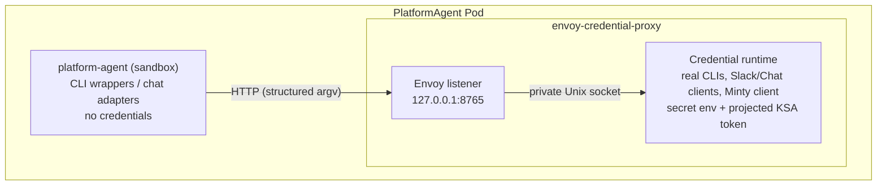

In the default sidecar layout the PlatformAgent sandbox container receives no API keys, access tokens, refresh tokens, or Kubernetes ServiceAccount tokens through its environment or filesystem. Credentials live exclusively in a trusted **Envoy credential-proxy sidecar** inside the same Pod, and the sandbox reaches credentialed capabilities only through a policy-enforced local proxy.

Enabling [`spec.security.splitCredentialBrokerPod`](#splitting-the-broker-into-its-own-pod) changes that in one specific way: the broker moves to a Pod of its own and the sandbox is given a projected ServiceAccount token so it can authenticate across the network. Every unqualified "the sandbox holds no token" statement on this page describes the sidecar layout; [the agent now holds a credential](#the-agent-now-holds-a-credential-and-that-was-a-choice) has the trade.

This page summarizes the architecture. The canonical design — including scope, deny-policy details, migration steps, and CI verification assertions — is [`docs/credential-isolation-design.md`](https://github.com/gke-labs/kube-agents/blob/main/docs/credential-isolation-design.md).

## Pod anatomy

Each PlatformAgent runs as one long-lived Pod with these managed containers. The credential proxy
is a **native sidecar** — an `initContainers` entry with `restartPolicy: Always`, needing Kubernetes
1.29+ — so it starts before the others and does not appear in `spec.containers`:

| Container                  | Trust level | Role                                                                                                                                                |
| -------------------------- | ----------- | --------------------------------------------------------------------------------------------------------------------------------------------------- |
| `platform-agent`           | Untrusted   | The agent sandbox — credential-free env and mounts, CLI wrappers.                                                                                   |
| `envoy-credential-proxy`   | Trusted     | Envoy, the credentialed command and chat runtime, and the event watcher, which forwards cluster events using its own separate Kubernetes-API token. |
| `fluent-bit`               | Trusted     | Log forwarding.                                                                                                                                     |
| `platform-agent-dashboard` | Untrusted   | Optional local dashboard (also credential-free).                                                                                                    |



The sandbox image contains only **wrapper binaries** for `gcloud`, `kubectl`, `gh`, and `git`. A wrapper sends the executable name and argument array to Envoy at `127.0.0.1:8765`; the credential runtime executes the corresponding real CLI and returns output and exit status. It never evaluates an agent-supplied shell command, and the runtime's Unix socket is mounted only in the sidecar, so the sandbox cannot bypass Envoy. The real credential-aware CLIs ship in a separate `credential-proxy` image that the sandbox never runs.

**The sandbox environment does not cross the boundary.** The command runs with an environment the sidecar builds itself, so exporting a variable in the agent shell has no effect on the proxied process. Two values are carried explicitly in the request instead, and both must resolve inside the shared agent workspace or the request is rejected with `400`:

- **Working directory** — so relative paths in `git` and `kubectl` arguments mean what the agent intends.
- **`KUBECONFIG`** — how a Cluster Agent profile pins itself to one target cluster. Without a `KUBECONFIG`, commands use the context the sidecar bootstrapped for the host cluster.

**A kubeconfig names a cluster; it never supplies content.** The pin lives on the shared volume, so it is a document the agent can write — and a kubeconfig is executable configuration, not passive data. Fields such as `users[].user.exec.command`, `clusters[].cluster.server`, and `users[].user.tokenFile` would respectively run a program next to the credentials, redirect the minted access token, and disclose a sidecar file as a bearer token. None of it is visible to the [command policy](#request-paths), whose rules match on the argument array: the argv is only ever `kubectl get pods`. The design doc has the [full enumeration and the reasoning](https://github.com/gke-labs/kube-agents/blob/main/docs/credential-isolation-design.md#agent-supplied-kubeconfigs).

So the sidecar reads exactly one string out of the file the agent wrote, `current-context`, accepts it only if it is a well-formed `gke_<project>_<location>_<cluster>` name, and regenerates the kubeconfig itself with `gcloud container clusters get-credentials` into a directory mounted only in the sidecar. That regenerated file is what every proxied command runs against (on an install that has armed the [scoped service account pool](/kube-agents/reference/security-and-iam/#the-scoped-service-account-pool), `kubectl` runs against a further derivation of it carrying the pool member's token). The same substitution is applied to a `--kubeconfig` flag, which kubectl prefers over the environment. `get-credentials` is the one command allowed to author a kubeconfig: it writes into the sidecar's own directory and the result is copied out to the workspace afterwards, so the visible pin still exists for the agent to inspect without ever being what a later command opens.

Naming a cluster is not extra authority — `get-credentials` is bound by the same IAM the proxy already runs under, so it can only reach clusters this identity could reach anyway. A pin the proxy cannot regenerate from (no `current-context`, a non-GKE context name, a merged `path1:path2` list) is rejected with `400` rather than honored.

**Tree-mutating `git` runs only inside a leased workspace.** Containment to the shared volume keeps the agent off the sidecar's filesystem; it says nothing about keeping concurrent agents off each other, and a Pod runs six audit crons alongside every kanban worker. A skill takes a lease and works in a private clone under `/opt/data/gitops/<lease>/<owner>__<name>`; the proxy refuses `git add`, `commit`, `checkout`, `push`, `reset` and the other verbs that write a working tree or a remote ref unless the resolved directory — after any `-C` redirect — sits under one holding a `.lease` marker. Read verbs, `fetch`, and `clone` are unaffected. The refusal comes back as `SECURITY_POLICY_BLOCKED` with rule `git.workspace.lease`, and `CREDENTIAL_PROXY_REQUIRE_GIT_LEASE=0` disables the check for an unmigrated skill.

It is also a floor only for the verbs on the list. A repository's own `.git/config` is read by every `git` invocation, including read-only ones, so `git status` in a directory the agent wrote reaches the credential holder without a lease and without a mutating verb. The lease mechanism is not what stands between the agent and that; see [Splitting the broker into its own Pod](#splitting-the-broker-into-its-own-pod) for what does.

This is a floor, not an ownership check: the wrapper sends an argument array and a working directory, never a caller identity, so the sidecar can tell that a push is happening inside _some_ lease but not whose. Whether the lease is the caller's own is checked in the sandbox by the skill that holds it. [`docs/designs/gitops-workspace-leases.md`](https://github.com/gke-labs/kube-agents/blob/main/docs/designs/gitops-workspace-leases.md) is canonical for the layout and the reaper.

**`git` runs with its configuration pinned by the proxy.** `git` is the one permitted executable that takes both its transport and its helper programs from configuration files, and it reads several of those from the shared volume — so its defaults are overridden rather than trusted. Every proxied `git` runs with the transport allowlist restricted to `https`, the system configuration file suppressed, the global configuration file pinned to a path mounted only in the sidecar, the hooks directory pinned to an empty directory the agent cannot write to, the file-system monitor disabled, commit signing disabled along with the signing program of every signature format git supports rather than just the default one, subcommand autocorrection off, and both of the editors `git` launches set to a command that does nothing — the sidecar has no terminal, so nothing that needed one could have worked anyway.

The proxy also refuses, in the argument array, the global options that would undo any of that — `-c` and `--config-env`, which set configuration outranking the pins; `--exec-path`, which chooses where git looks for the program to run; `--git-dir` and `--work-tree`, which name a repository directly and so sidestep the workspace containment applied to the working directory; and `--global`, `--system` and `--file`, which write the configuration files the proxy pins. `-C` remains available for choosing a directory inside a leased workspace, since the containment check follows it, and repository-local `git config` remains available because that is how a clone's commit identity is set. Refused alongside them are the subcommands whose purpose is to run a caller-named command, among them `bisect`, `difftool`, `mergetool`, `filter-branch`, `send-email` and `help`. Refused too are the options that do the same job on an ordinary subcommand: running a command once per commit during a rebase, over the matches of a search, to compute a commit trailer's value, or — for `--help` — through the documentation viewer. The viewer needs both entries: `git help -m` and `git help -w` run the program named in `man.<tool>.cmd` or `browser.<tool>.cmd`, and `git status --help` reaches the same viewer with `status` in the subcommand slot, so neither refusal closes it alone. No pin can reach those keys, because the name inside the key is arbitrary. `-h` stays available; git answers it from the subcommand's own option table without starting a viewer. The design doc has the [full list and the reason it is a denylist rather than an allowlist](https://github.com/gke-labs/kube-agents/blob/main/docs/credential-isolation-design.md#git-configuration). Every refusal comes back as `SECURITY_POLICY_BLOCKED` with rule `git.argument.refused`, and no shipped skill uses any of them.

These pins do not extend to configuration stored inside a repository's own `.git/config`, which the agent authors and which `git` honors both for settings that name a program to run and for settings that decide which host a fetch contacts and which credential helper answers for it. Reducing that surface is why the proxy is moving toward receiving file content from the agent rather than operating inside a directory the agent controls: with `CREDENTIAL_PROXY_CONTENT_WORKSPACE` set, the proxy serves `/v1/workspace/*`, where the agent sends file content and a commit message and the proxy writes, commits and pushes in a working tree on its own volume that the agent has no path to. It is off by default, the routes answer 404 while it is off, and no shipped skill uses them yet — so until the skills are moved onto it, treat a cloned working tree as agent-controlled input rather than as a trust boundary. The design doc has [the mechanism and what it is and is not worth](https://github.com/gke-labs/kube-agents/blob/main/docs/credential-isolation-design.md#broker-owned-working-trees).

**`kubectl` and `gcloud` are read-only by default.** The proxy enforces that `kubectl` may not run mutating verbs like `delete`, `create`, `patch`, or `rollout restart`, and that `gcloud` may not run commands that change cloud resources. It refuses the flags that would change which identity a command authenticates as or which server receives the credential — `--as`, `--server`, `--token`, `--kuberc`, `--insecure-skip-tls-verify` and their `gcloud` equivalents — and the refusal comes back as `SECURITY_POLICY_BLOCKED` with a rule such as `kubernetes.read-only` or `kubernetes.identity-change-forbidden`.

**`gh` may not complete a change on GitHub.** The agent's job is to propose, so the proxy refuses the verbs that would let it also dispose: merging a pull request (`github.merge`), approving a review (`github.assent`), mutating through the REST API — `gh api` with `-X POST|PUT|PATCH|DELETE` or a field flag (`github.api-mutation`), triggering a workflow run or cutting a release (`github.pipeline-trigger`), and repository administration — secrets, variables, and repository delete, archive or edit (`github.repo-administration`). Rulesets are not on that list because `gh ruleset` cannot change one: it has only `check`, `list` and `view`, and reshaping a ruleset goes through `gh api`, where `github.api-mutation` refuses it. Opening pull requests, issues and comments is untouched, which is the path the product runs on. The refusal is `SECURITY_POLICY_BLOCKED` with the rule id.

These are **deny** rules shipped in the operator's policy ConfigMap, not entries in the `command_policy.py` allowlist the paragraph below is about, so a false refusal here is fixed in a different place — see the appeal note at the end of this section.

**How much this allowlist is carrying depends on the permission set.** On a default `read-only` install it is the outermost of three layers, not the whole control: the agent's KSA holds no write verb on workloads or cluster state, so the API server refuses a mutation the allowlist missed, and the GSA holds `container.viewer`/`container.clusterViewer` only, so a `gcloud` mutation is refused at GCP. [Security and IAM](/kube-agents/reference/security-and-iam/) is canonical for what the agent may and may not do; this page describes only the proxy's own layer.

Under a `custom` permission set that names an admin role, that stops being true. `roles/container.admin` authorizes the agent through IAM regardless of its Kubernetes RBAC, so both layers beneath the allowlist fall away and a command it fails to refuse runs with the sidecar's full credential. Treat the allowlist as the only control in that configuration — which is one reason the built-in bundle that granted that role was removed.

Kubernetes impersonation is planned and not yet deployed; once it ships, the API server will authorize each request as the requesting human user rather than as the agent. Note also that the current deployment shares one Google service account across every agent — that is the gap impersonation closes, not a mitigation.

A first deployment in a live environment will find read-only commands nobody anticipated. For a `kubernetes.*` or `gcp.*` refusal the fix is to add the verb to the allowlist in `command_policy.py` and ship it — except `gcp.scoped-sa.unmapped-scope`, which is not a verb problem at all: it means the request named a cluster the [scoped service account pool](/kube-agents/reference/security-and-iam/#the-scoped-service-account-pool) has no entry for, and the fix is adding the cluster to the pool's mapping (or leaving the pool disarmed). For a `github.*` or `git.*` one it is the deny policy the operator renders, which is a different file and a different review. Either way, that keeps the change reviewable and scoped to the one command that was missing. Report the blocked command to your infrastructure team with the rule id from the refusal.

## Credential placement

| Data                             | Sandbox                                                                               | Credential sidecar        |
| -------------------------------- | ------------------------------------------------------------------------------------- | ------------------------- |
| `spec.deployment.env`            | No                                                                                    | Yes                       |
| Slack tokens                     | No                                                                                    | Yes, Secret-backed env    |
| PlatformAgent external API key   | No                                                                                    | Yes, Secret-backed env    |
| Session KV API key and HMAC salt | Yes, Secret-backed env                                                                | Yes, API key only         |
| Automatic KSA token mount        | Disabled                                                                              | Disabled                  |
| Explicit projected KSA token     | Not mounted in the sidecar layout; mounted read-only under `splitCredentialBrokerPod` | Read-only, one-hour token |
| gcloud/kubectl configuration     | No                                                                                    | Private `emptyDir`        |
| GitHub installation token/cache  | No                                                                                    | Private `emptyDir`        |
| Agent workspace                  | Yes                                                                                   | Yes, for proxied commands |

`SESSION_KV_API_KEY` and `SESSION_KV_SALT` are the sandbox's only Secret-backed environment variables, and both are pod-scoped: neither opens anything outside this Pod. They cannot sit behind the proxy because the sandbox is the _server_ here — `session_kv_server.py` binds `127.0.0.1:8699` and needs the key in order to reject callers that are not the event watcher, the Platform MCP server, the `incident_context` plugin, or the gateway's kanban notifier — and because the salt hashes chat identities before they are written, which has to happen where the identity already is. The design doc has the [full reasoning](https://github.com/gke-labs/kube-agents/blob/main/docs/credential-isolation-design.md#the-loopback-only-exception). Both are optional in the sense that the pod starts without them, and one of them is not optional in practice: the `k8s-event-watcher` in the credential sidecar authenticates with `SESSION_KV_API_KEY` and treats an empty value as fatal, so it exits on every start and no cluster events are watched at all — the container stays Ready, so its log is the only place that says so. The Session KV server also answers `503`, and identity hashing falls back to a per-process salt with a warning.

Pod-wide `automountServiceAccountToken` is `false`. The sidecar's projected token uses the audience `kubeagents-credential-proxy` and expires after one hour; the event watcher gets a separate one-hour Kubernetes-API token projection, mounted in the same sidecar at the conventional in-cluster path. Neither token is mounted in the agent or dashboard containers.

## Request paths

- **CLI commands** — only `gcloud`, `kubectl`, `gh`, and `git` are accepted. The proxy rejects known credential-disclosure, credential-replacement, and self-modification operations, and the GitHub write path (see below); interactive TTY programs, unbounded streaming, sandbox-only file paths, and background processes fail closed.
- **Chat** — Slack and Google Chat adapters send credential-free payloads to Envoy; the credential runtime owns the platform tokens and performs the external API calls, enforcing user allowlists and payload limits.
- **PlatformAgent API** — the Service targets port 8643 on the sidecar, which validates the external bearer key and forwards to the sandbox API on loopback (port 8642) with a non-secret sentinel. The real key never enters the sandbox.
- **GitHub** — the sidecar obtains a Google OIDC identity token and calls [Minty](/kube-agents/deploy/token-minter/), which brokers a repository-scoped GitHub App installation token with a maximum one-hour lifetime. The App's private key stays in Cloud KMS.

## Guarantee and limitation

**Guarantee, in the sidecar layout:** the operator does not place managed credentials in the sandbox container's environment, root filesystem, persistent agent volume, or mounted ServiceAccount token path. `spec.deployment.env` is applied to the credential sidecar because it may contain credentials (only a short allowlist is copied to the sandbox — the four OpenTelemetry settings and the three `ALERT_DAILY_LIMIT_*` alert ceilings — as literal values only). The one exception is `splitCredentialBrokerPod: true`, which mounts a projected ServiceAccount token in the sandbox on purpose; everything else in this list still holds there.

**Limitation:** containers in one Pod share a network namespace and one Pod identity. The sandbox has no KSA token file in this layout, but it can technically reach the GKE metadata server used by the sidecar — a Pod-level NetworkPolicy cannot block metadata for one container while allowing it for another. The design meets the scoped filesystem-and-environment goal but does not provide the stronger identity boundary of separate Pods.

**This limitation is live in the default install.** [Denying the sandbox the metadata server](#denying-the-sandbox-the-metadata-server) is available, but only on top of the broker Pod split, which is itself off by default — and even with both on, the gateway policy the operator renders for the same Pod still permits the metadata path. A stock agent can reach `169.254.169.254` and mint the Workload Identity token directly, bypassing the broker and every policy control in front of it.

What the two containers do **not** share is a process namespace or a user. No configuration sets `shareProcessNamespace` — the dashboard-enabled one used to — and the sidecar runs as its own UID, so the sandbox cannot read the sidecar's environment out of `/proc`. [`docs/security-requirements.md`](https://github.com/gke-labs/kube-agents/blob/main/docs/security-requirements.md) tracks both that requirement and the Pod-sharing limitation above formally.

## Splitting the broker into its own Pod

`spec.security.splitCredentialBrokerPod` renders the credential runtime as a Deployment and Service of its own instead of a sidecar. It closes the shared-network-namespace limitation above: with the broker in another Pod, "reachable on `127.0.0.1`" is no longer what decides who may spend the agent's credentials, and a Pod-level NetworkPolicy can restrict the sandbox's egress without restricting the broker's. That is what [`spec.security.egressPolicy`](#denying-the-sandbox-the-metadata-server) then does, and cannot do without this flag.

**It defaults to `false`, and today it should stay there.** The reason is the working directory. The broker runs proxied commands in a directory the _agent_ created on the shared data volume — a leased git clone, a Cluster Agent profile home, a `.kubeconfigs` directory are all written by one process and used by the other. So both Pods have to see the same files, and the default GKE persistent disk is ReadWriteOnce, which two Pods on different nodes cannot both mount read-write.

**That coupling is a property of the current design, not something the split needs, and it is being removed rather than worked around.** The broker will own the workspace on an ordinary ReadWriteOnce volume of its own, and the agent will hand it file content and a commit message instead of a directory. That also collapses the wider problem of the agent owning a tree the broker then runs `git` in — the repo-local `.git/config` class that argument-level checks cannot close by enumeration. Until that lands, this flag is a mechanism without an adoptable storage story.

**Note what that class is not gated by.** `.git/config` is read by every `git` invocation, so a `core.fsmonitor` entry written into a directory under the shared workspace root executes in the broker on the next `git status` — no lease, no mutating verb, nothing the argument policy inspects. It is not new with the split: the sidecar layout has the same exposure, at the same UID, through the same shared volume, so this flag neither creates nor worsens it. It is the reason the flag stays off until the broker owns its own workspace, because that is the change that removes it rather than narrowing it.

**Two things that look like workarounds and are not.** A ReadWriteMany claim does satisfy the current design, and you may choose one; it is not a requirement of this product, and the managed options bill on provisioned capacity with a floor far above what an agent workspace needs. Co-scheduling the two Pods on one node against a ReadWriteOnce claim is worse: the next rolling update deadlocks, because the replacement Pod cannot attach a volume the outgoing Pod still holds and the outgoing Pod is not removed until the replacement is ready. Node affinity is only honoured at scheduling time, so it constrains placement and nothing after it, and the two Pods become one failure domain.

**What going without a shared filesystem actually looks like** is a scheduling failure, not a policy refusal. The broker Pod stays `Pending` with a `Multi-Attach error for volume` and never becomes a Service endpoint, so every proxied command in the sandbox reports `credential proxy unavailable: [Errno 111] Connection refused`. That is the same symptom an unhealthy sidecar produces, which is why [Troubleshooting](#troubleshooting) below lists both causes. The operator logs a warning naming the claim and its access modes. The broker's own workspace-containment check will not catch it: it compares paths, both Pods are configured with the same workspace root, so the path always looks correct — what is missing is the data behind it.

**It also requires turning the event watcher off, and the operator refuses the combination rather than rendering it.** The `k8s-event-watcher` runs inside the credential container and posts what it sees to the Session KV server the sandbox binds on `127.0.0.1:8699`. Both of those are properties of sharing a Pod. Split the broker and the watcher goes with it, with no loopback to deliver on and no API key — measured on a cluster, it exits and is retried for the life of the Pod while the container stays `Ready` and no cluster event reaches the agent. So `splitCredentialBrokerPod: true` with `harness.eventWatcher.enabled` anything but `false` is refused: the agent goes `Degraded` with reason `SplitBrokerStrandsEventWatcher`, no workload is applied, and the message names the field to set. The refusal sits after the ServiceAccount, RBAC, PVCs and ConfigMaps, so those are reconciled either way, and on an agent already running with the split it leaves the running Pods alone rather than taking them down. The watcher defaults to enabled, so this is what a stock CR gets. Losing fleet event delivery is the price of the split today, and the refusal is there so it is a decision rather than something you find in a log weeks later. Giving the watcher a home that survives the split — a Service in front of the Session KV server, or the watcher moved into the agent Pod — is separate work.

When the flag is on:

- The broker becomes `<name>-credential-proxy`, a single-replica Deployment with a Service on 8765. The agent's `CREDENTIAL_PROXY_URL` and the two chat relay URLs address that Service.
- **The call is authenticated.** The agent presents a projected ServiceAccount token with the audience `kubeagents-credential-proxy`; the broker verifies it with a Kubernetes `TokenReview` and refuses anything else with `401`. This is not optional plumbing — the sidecar layout's access control was the loopback listener and a `0600` socket, and both of those are properties of sharing a Pod.
- The front door for the PlatformAgent API stays in the agent Pod as an `agent-api-proxy` container. It forwards to port 8642 on loopback behind a fixed non-secret sentinel, which is only safe because it never leaves the Pod, so it does not follow the broker across the boundary.

Two things it does not do, and both are deliberate:

- **The two Pods share a ServiceAccount.** The Workload Identity IAM binding names it, so giving the agent one of its own would take the broker's cloud credentials with it. The identity the broker verifies is therefore "a Pod running as this ServiceAccount" — enough to exclude the rest of the cluster, not enough to tell the agent Pod from the broker Pod.
- **The token crosses the network in cleartext**, as the [Minty](/kube-agents/deploy/token-minter/) call already does. Anyone who can observe pod-to-pod traffic in the namespace can replay it until it expires. It is audience-bound, so it is useless against the Kubernetes API or any other service, and it is worth at most an hour. mTLS is the fix and is not deployed.

### The agent now holds a credential, and that was a choice

Under the sidecar layout the sandbox holds nothing at all — the broker's trust comes entirely from the socket. With the flag on, the projected token is mounted into the `platform-agent` container itself, so the model can read it. A prompt-injected agent gains no new authority _inside_ the Pod, because it could already call the broker by running `kubectl`. What it gains is **exportability**: the token is a file, and a file can be exfiltrated, after which an outside party has broker access — bounded by the command policy — until the token expires.

Against the credential requirements this mechanism is short-lived, audience-bound and independently revocable, but **not non-exportable**, and that last clause is the one it misses.

**An alternative was considered and deferred.** This same change already contains the pattern that would avoid it: `agent-api-proxy` is a credential-holding container in the agent Pod, on loopback, at a different UID, with no volumes the sandbox can read. A mirror image of it — an egress forwarder in the agent Pod that holds the token, listens on `127.0.0.1:8765`, and attaches the credential on its way out to the broker Service — would keep the wrappers unchanged and preserve "the sandbox holds no credential at all". It is not built here because it is a new component with its own failure modes, lifecycle and review surface, and this change was scoped to the split and its transport. It remains the obvious next step for anyone hardening this, and nothing in the current design forecloses it: the client's `authorization_headers()` would simply return nothing and the forwarder would supply the header instead.

## Denying the sandbox the metadata server

`spec.security.egressPolicy: Allowlist` renders one NetworkPolicy on the agent Pod: default-deny egress, with rules for DNS, the credential broker, LiteLLM, the managed OpenTelemetry collector, and whatever `spec.security.egressAllowlist` adds. The metadata server is denied by not appearing on that list.

### This blocks nothing today

**Turning this on does not take any egress away from the agent Pod. It cannot.** Adding a NetworkPolicy is a monotone operation: policies selecting one Pod are unioned, the Pod may send whatever any of them permits, and the API has no deny rule at all. The agent Pod is already selected for egress by `<name>-gateway-netpol`, which the operator renders on every reconcile whether or not you set this field, so with the flag on the Pod's permitted egress is a strict _superset_ of what it was with the flag off. In the default shape it adds the credential broker on TCP 8765, and — when the agent is not exporting telemetry — the collector namespace on 4317/4318, because the gateway policy renders its own OTel rule only while there is an endpoint to export to and this one is rendered unconditionally. The `platformagent-egress-allowlist` golden fixture is that case: `gke-managed-otel` appears in the new policy and not in the gateway one.

That holds wherever another policy still permits the wider egress, which is every install shape but one. `spec.networkPolicy.enabled: false` stops the operator rendering `<name>-gateway-netpol` at all and deletes one it owns — but it withholds only the operator's own policies. A Kustomize install still carries the statically applied `platform-agent-core-egress` set, which selects the same Pod and permits the metadata path and external 443, so the union argument resumes there. On a **Helm** install with the field false, this policy really is the only one selecting the agent Pod, and on an enforcing CNI it then default-denies for real — the metadata server, but also GitHub, web search, external 443 and everything else not on the allowlist. Everywhere else it is a property of the API, not of a particular cluster.

What `<name>-gateway-netpol` already permits, and this therefore cannot remove:

- `169.254.169.254/32` on TCP 80, plus the discovered metadata-daemon port (`988` by default) to both link-local metadata addresses — the pre- and post-DNAT forms of a metadata request. The metadata path stays open.
- TCP 443 to `0.0.0.0/0` minus the private ranges, unless FQDNNetworkPolicy is enabled. Every HTTPS destination on the public internet stays open, and with it the exfiltration half of what this is meant to be.

`platform-agent-core-egress` from [`deploy/kustomize/platform/`](https://github.com/gke-labs/kube-agents/tree/main/deploy/kustomize/platform) permits the same metadata path and selects the agent Pod by `app.kubernetes.io/name`. Kustomize installs have it; Helm installs do not. It changes nothing either way — the gateway policy alone settles the point.

The overlap is deliberate rather than an accident. Workload Identity needs that path, and in the sidecar layout the broker is in the Pod that needs it, so the gateway policy cannot stop permitting it without breaking every install. Narrowing it to the broker Pod, once the broker has left, is the work that turns this field into a control.

**So what is it for today?** Two things, neither of them enforcement. It renders an auditable statement of the destinations the agent is supposed to need, as an object you can diff and a reviewer can read. And it settles the field, the refusal rules and the reconcile behaviour now, so that narrowing the gateway policy later is a one-policy change rather than a new feature. If you were planning a capability-impact review before enabling this, you do not need one yet; [what it will cost](#what-it-will-cost-once-it-does-block-something) says when you will.

The complementary control is removing the `iam.gke.io/gcp-service-account` annotation from the agent Pod's ServiceAccount once the broker has one of its own — deny the route versus remove the identity. That one does not depend on the CNI at all, and unlike this it would take something away immediately. It is separate, planned work.

### The other conditions, plainly

Only the first is enforced by the operator.

1. **`splitCredentialBrokerPod` must be `true`, and it defaults to `false`.** This is why the two features are one story. A NetworkPolicy selects Pods, never containers, and the broker reaches the metadata server on purpose. With the broker still a sidecar, the same policy governs both containers, so restricting the sandbox restricts the broker and every proxied command fails. **Asking for `egressPolicy: Allowlist` without the split is refused**, not quietly downgraded: the agent goes `Degraded` with reason `EgressPolicyRequiresSplitBroker`, no policy object is written, and reconciliation stops before the workload.
2. **The cluster CNI must enforce NetworkPolicy, and the operator cannot tell whether it does.** An unenforced policy is accepted, stored, and returned by `kubectl get` exactly like an enforced one; there is no field, condition or event to read. GKE Autopilot and GKE Dataplane V2 always enforce. A GKE Standard cluster created without network policy gets a no-op.
3. **No other policy may widen it**, which is the point above and also applies to anything an administrator adds later. Nothing detects that.
4. **The allowlist has to stay complete**, and it deliberately is not — see [what it will cost](#what-it-will-cost-once-it-does-block-something). Every gap is pressure toward a broader rule.

### What a refusal does, and does not do

**Refused means not reconciled, not stopped.** On a new agent those are the same thing — no Deployment is created. On an agent that is already running, the existing Pods keep running exactly as they were, **with metadata access**, and every subsequent change to the resource is ignored while the operator retries every 30 seconds. The refusal protects you from believing you have the control; it does not take the workload down to make the point. `kubectl describe platformagent` is where you find out.

The two refusal reasons differ in one way that matters:

- `EgressPolicyRequiresSplitBroker` renders **no** policy. The objection is to the policy existing at all in that layout, since it would govern the credential broker in the same Pod.
- `EgressAllowlistRefused` **still renders the policy**, minus the destinations it refused. The objection is to one value, not to the control, so the guardrail keeps being reconciled — delete it and the next pass puts it back — while the status stays `Degraded` until the spec is fixed.

### Turning it back off, which has an order

**Setting `egressPolicy: None` does not delete the policy.** The operator will not remove a guardrail it may not have created, so `<name>-sandbox-metadata-deny` stays in the namespace after the field goes off. On its own that is fail-closed and fine: the Pod it selects keeps a door shut that nothing is asking to open.

It stops being fine the moment `splitCredentialBrokerPod` goes off too, and the tempting way to get there is exactly the wrong one. Reverting the split alone is refused — the agent goes `Degraded` with `EgressPolicyRequiresSplitBroker`, while the broker and the running agent are left untouched — so the obvious next move is to clear `egressPolicy` in the same edit and unstick it. Do that and the broker comes back into the agent Pod, where the leftover policy is still selecting it. Today the gateway policy's union hides that, by this page's own argument above; the moment the gateway policy is narrowed or withheld, the same two-field edit is a broker with no metadata server. Treat the order as required rather than leaning on the union.

Revert in three steps instead, which never leaves the broker inside a policy written for the sandbox:

1. Set `egressPolicy: None`, leaving `splitCredentialBrokerPod: true`.
2. `kubectl -n NAMESPACE delete networkpolicy NAME-sandbox-metadata-deny`. This is safe only after step 1 — delete it while the field still says `Allowlist` and the next reconcile puts it straight back.
3. Set `splitCredentialBrokerPod: false`.

### Pre-enable checks

Two things to verify on the cluster, neither of which the operator can check for you:

- **Does the CNI enforce NetworkPolicy?** `gcloud container clusters describe CLUSTER --format='value(networkPolicy.enabled,networkConfig.datapathProvider)'`. Autopilot and Dataplane V2 always do. A GKE Standard cluster created without network policy gets a policy object that enforces nothing.
- **Does the cluster run NodeLocal DNSCache, and does DNS still resolve after enabling?** This one can take the agent down. NodeLocal DNSCache runs with `hostNetwork`, so on Cilium and Dataplane V2 its traffic carries a host or remote-node identity — and neither the `k8s-app: node-local-dns` Pod selector nor the `169.254.20.10/32` CIDR peer in the rendered rule is guaranteed to match that (the rule also carries the resolved cluster DNS ClusterIP, for the dataplanes that match the Service VIP instead), because CIDR peers do not select node identities unless `policy-cidr-match-mode` includes `nodes`, which is off by default. Both peers work on an iptables dataplane, which is why both are rendered. If neither matches, DNS is blocked outright and every destination in the allowlist becomes unreachable, because they are all reached by name. Check with `kubectl -n kube-system get ds node-local-dns` first, and after enabling confirm resolution from the agent container before trusting the policy.

### What it will cost, once it does block something

**None of this happens today** — with the one exception above: a Helm install running `spec.networkPolicy.enabled: false` on an enforcing CNI pays this whole bill the moment the flag goes on. Everywhere else, every destination below is one `<name>-gateway-netpol` still permits to the same Pod, so you can enable the flag and observe no behaviour change in either direction. This is the bill that falls due once the gateway policy is narrowed, and it is here so that the narrowing is not a surprise.

At that point the allowlist covers DNS (selector peers plus the resolved cluster DNS ClusterIP, the same ladder the gateway policy renders), the broker, LiteLLM, the OTel collector and the Hindsight memory API, and everything the agent container reaches on its own would go away:

- DuckDuckGo web search, which `deploy/shared/defaults/config.yaml` turns on for every profile (`web.backend: ddgs`), and the `browser` toolset, which only the Chat Agent disables;
- the `gke` and `developer_knowledge` MCP servers, which proxy `container.googleapis.com` and `developerknowledge.googleapis.com`;
- `github.com` reached directly from the sandbox — not the `gh` and `git` wrappers, which go through the broker;
- the metadata lookup in `cluster_agent_reconcile.py`, which is how that script finds its project id. It fails soft after a five-second timeout and falls back to `gcloud config get-value project`, a broker call that is on the allowlist, so the cost is the timeout on each tick. Setting `RECONCILE_PROJECT` skips it.

Credentialed `gcloud`, `kubectl`, `gh` and `git` would be unaffected either way: they are wrappers that call the broker, and the broker is on the list.

None of that would be accidental. A headless browser with unrestricted egress is the exfiltration path, so the capabilities this would remove are the same ones that make the control worth having. Weigh it as a trade rather than a regression, when it arrives.

### Restoring a destination

`spec.security.egressAllowlist.extraRules` takes NetworkPolicy egress rules verbatim. Two things to know:

- **NetworkPolicy matches addresses, never DNS names.** Restoring a hosted service means naming its published address ranges and keeping them current.
- **A rule whose `ipBlock` contains a metadata address is dropped, not narrowed.** That includes `0.0.0.0/0` with an `except` clause naming the metadata server — see below for why an `except` clause is not a block. To grant broad egress you have to carve the ranges around `169.254.169.252` and `169.254.169.254` yourself, in the spec, where a reviewer can see it.

`spec.security.egressAllowlist.controlPlaneCIDRs` is separate because there is no NetworkPolicy peer for "the Kubernetes API server": on GKE the control plane is not a Pod and not in the cluster, and the in-cluster `kubernetes` Service address is translated to it before policy is evaluated. Left empty the rule is simply absent and nothing in the agent Pod can reach the API, which matters above one replica, where the container runs `leader_elect.py` and holds a Lease. Find the range with `gcloud container clusters describe CLUSTER --format='value(privateClusterConfig.masterIpv4CidrBlock,endpoint)'`.

### Why it is default-deny rather than "allow everything except the metadata server"

The obvious shape — one broad rule with the metadata address in an `except` clause — is what this repository shipped once before, and it is unsound twice over on GKE:

- **On GKE Dataplane V2 it is a near-total outage, not a permissive rule.** Google's documentation states that Pod traffic is never covered by an `ipBlock` rule, so a policy whose only peer is `0.0.0.0/0` permits no Pod-to-Pod traffic at all — not kube-dns, not LiteLLM, not the broker.
- **On an iptables dataplane the `except` clause names an address the policy never sees.** A request to `169.254.169.254:80` is translated to the node-local metadata server at `169.254.169.252:988` in NAT PREROUTING, before the filter rules run. This is [kubernetes/kubernetes#68078](https://github.com/kubernetes/kubernetes/issues/68078), open since 2018 and titled "Network policy not properly blocking GKE metadata IP".

Default-deny sidesteps both: it names Pods with selectors rather than CIDRs, and it does not have to predict which address the request was rewritten to, because neither address is permitted. For the same reason all three metadata addresses — `169.254.169.254`, `169.254.169.252` and the IPv6 `fd20:ce::254` — are refused in `extraRules`.

It is also why this is one policy object and not two. There is no deny rule in NetworkPolicy, so a separate "everything except metadata" policy would not subtract the metadata server from an allowlist. It would add the internet to it.

## Troubleshooting

**Every CLI in the sandbox reports `credential proxy unavailable`.** The `gcloud`, `kubectl`, `gh`, and `git` commands inside `platform-agent` are wrappers that forward to the broker. When nothing is listening at the other end, all four fail the same way:

```text
credential proxy unavailable: [Errno 111] Connection refused
```

This is an availability problem rather than an authentication one — a rejected credential comes back as an HTTP error, not a refused connection. There are two causes, and which applies depends on whether the broker is a sidecar or a Pod of its own.

_Sidecar layout (the default)._ The sidecar is not listening. Inspect it rather than the CLI:

```bash
kubectl get pods -n kubeagents-system
kubectl logs -n kubeagents-system deploy/platform-agent-gateway -c envoy-credential-proxy
```

_Split layout (`spec.security.splitCredentialBrokerPod: true`)._ The wrappers cross a Service, so the same message also means the broker Pod has no ready endpoint. The usual reason is the shared-filesystem coupling described above: the Pod cannot attach the volume the agent Pod holds, and sits `Pending`. Check the endpoint first and the events second — `Multi-Attach error for volume` is the tell.

```bash
kubectl get endpoints -n kubeagents-system platform-agent-credential-proxy
kubectl describe pod -n kubeagents-system -l app=platform-agent-credential-proxy
kubectl logs -n kubeagents-system deploy/platform-agent-credential-proxy
```

**Diagnostics run inside the Pod are misleading while the sidecar is down.** Those wrappers are the only `gcloud` and `kubectl` the sandbox has, so the commands you would normally reach for return the same connection error instead of describing the Pod's identity. Test that identity from a throwaway Pod using the same ServiceAccount:

```bash
kubectl run wi-check -n kubeagents-system --rm -it --restart=Never \
  --image=google/cloud-sdk:slim \
  --overrides='{"spec":{"serviceAccountName":"kubeagents-platform-agent"}}' \
  -- gcloud auth print-access-token
```

**The sidecar exits during startup.** The credential runtime runs `CREDENTIAL_PROXY_BOOTSTRAP_COMMAND` before it begins serving, and a non-zero exit stops the container — and because the proxy is a native sidecar the app containers never start at all, so the Pod sits in `Init:CrashLoopBackOff` rather than running with one container unhealthy. The command's stdout and stderr are written to the sidecar's log, so `kubectl logs -c envoy-credential-proxy` carries the reason. Bootstrap failures usually mean the Pod cannot reach the cluster or mint a token; see [Security & IAM](/kube-agents/reference/security-and-iam/) for the Workload Identity binding it depends on.

## Where to go next

- [Security & IAM](/kube-agents/reference/security-and-iam/) — Workload Identity, the GCP permission sets, and the read-only Kubernetes RBAC.
- [Token minter (Minty)](/kube-agents/deploy/token-minter/) — short-lived GitHub App tokens via KMS.
- [Full design doc](https://github.com/gke-labs/kube-agents/blob/main/docs/credential-isolation-design.md) — scope, deny policy, migration, and CI verification assertions.
