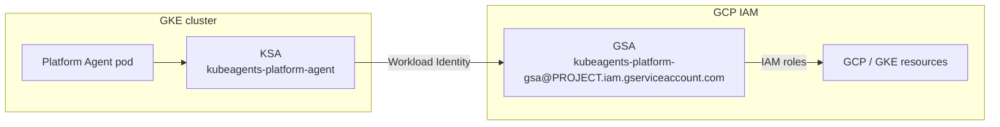

## What the agent can and cannot do

This is the canonical answer. Other pages summarize it and link here; if they appear to disagree, this page is correct.

"Is the agent read-only?" has **three different answers depending on which plane you mean.** Conflating them is the most common misreading of this project's security posture.

| Plane                         | What it governs                                                   | Can the agent write?                                                                                                                                                                                  |
| ----------------------------- | ----------------------------------------------------------------- | ----------------------------------------------------------------------------------------------------------------------------------------------------------------------------------------------------- |
| **Kubernetes RBAC** (the KSA) | Everything the agent does against a cluster's Kubernetes API      | **No** for workloads and cluster state — read-only in every configuration apart from a leader-election housekeeping Role confined to its own namespace, and it cannot read Secrets. Enforced by RBAC. |
| **GCP IAM** (the GSA)         | GKE/Google Cloud control-plane calls, including via the `gke` MCP | **No, with the default `read-only` permission set.** Yes, if you opt in to `gke-admin`. Enforced by IAM, chosen at provisioning.                                                                      |
| **The GitOps path**           | Changes to your infrastructure-as-code repository                 | Yes — by opening a pull request a human must review and merge.                                                                                                                                        |

### What that means in practice

- **Workloads and cluster state cannot be mutated through the Kubernetes API by this agent.** The KSA's only write grant is the housekeeping Role `kubeagents:leader:<namespace>:<name>` — write on leader-election `leases` plus `get`/`patch` on `pods`, both confined to the agent's own namespace. Beyond that it holds no write verb (see [Kubernetes RBAC](#kubernetes-rbac)). This holds regardless of any other setting.
- **GCP control-plane mutation is enforced off by default.** The default `read-only` permission set gives the GSA viewer roles only, so cloud-side writes fail at IAM. If you opt in to `gke-admin` at provisioning, that changes: the GSA then holds `roles/container.admin`, and the agent's `gke` MCP server proxies `container.googleapis.com`, which exposes cluster-management tools. In that configuration, what stops the agent using them is its **persona** (`SOUL.md §1`, "automation first" — infrastructure changes go through Git), not a permission boundary.
- **Persona rules are guidance, not enforcement.** A prompt-injection or reasoning failure is bounded by IAM, not by `SOUL.md`. Keep the default `read-only` set if "read-only on the cloud plane" must be an enforced property of the deployment rather than an intended behaviour of the model (see [Configuring read-only mode](#configuring-read-only-auditing-mode)).
- **The intended write path is always GitOps** — the agent proposes, a human merges, your reconciler applies. See [Secure write path](#secure-write-path-gitops).
- **The chat front door holds no infrastructure tools at all.** Chat ingress terminates at the Chat Agent (the pod's `default` Hermes profile), whose config pins every surface to routing, kanban-delegation, and per-user memory tools only — no GKE, file, or GitOps write tools. A prompt injected through chat must still be delegated to the Platform Agent, where the IAM and RBAC boundaries above apply. See [ChatOps](/kube-agents/concepts/chatops/).
- **Cluster Agents are scoped-down, not scoped-up.** Each per-cluster [Cluster Agent](/kube-agents/concepts/cluster-agents/) profile shares the pod's identity (same KSA/GSA, so the same IAM and RBAC ceilings apply), but its config template exposes only the read-only `gke` and `developer_knowledge` MCP servers — no `platform_control`, no GitOps write path — and its `KUBECONFIG` is pinned to one cluster. It proposes fixes back over the kanban card; only the Platform Agent can turn them into PRs.

> The [end-state design](https://github.com/gke-labs/kube-agents/blob/main/docs/architecture/01-vision-scope.md) removes the second row's opt-in escalation entirely: agents stay read-only on cloud APIs in every configuration, and the `create_cluster` tool is withdrawn. That is a target, not current behaviour.

---

The rest of this page details the two enforced planes.

## Identity model

The agent uses [GKE Workload Identity](https://cloud.google.com/kubernetes-engine/docs/how-to/workload-identity) to bind its in-cluster KSA to a GSA, so no static GCP key ever lands in the cluster.



The IAM side of the binding is pre-provisioned by [`provision_04_gcp_iam.sh`](https://github.com/gke-labs/kube-agents/blob/main/k8s-operator/scripts/provision_04_gcp_iam.sh), which grants `roles/iam.workloadIdentityUser` on the GSA to the KSA member `<project>.svc.id.goog[kubeagents-system/kubeagents-platform-agent]`. The KSA-side annotation `iam.gke.io/gcp-service-account: kubeagents-platform-gsa@<project>.iam.gserviceaccount.com` is applied by the operator from `spec.security.serviceAccountAnnotations` on the [`PlatformAgent` CR](/kube-agents/operator/platformagent-crd/).

## GCP IAM permission sets

`provision_04_gcp_iam.sh` grants the agent GSA one of three permission sets, chosen with the `PLATFORM_AGENT_PERMISSION_SET` variable (prompted during provisioning, cached in `vars.sh`). Both entry points choose from the same three: the provisioner prompts for it, and the zero-friction installer asks the same question — or takes `--permission-set` / `--custom-roles` — before writing `vars.sh`. `read-only` is the default in both:

| Permission set | `PLATFORM_AGENT_PERMISSION_SET` | Use it when                                                    |
| -------------- | ------------------------------- | -------------------------------------------------------------- |
| **gke-admin**  | `gke-admin`                     | The agent should manage GKE lifecycle and node pools directly. |
| **read-only**  | `read-only` (default)           | Auditing / monitoring only — no GCP write capability.          |
| **custom**     | `custom`                        | You supply the exact roles via `PLATFORM_AGENT_CUSTOM_ROLES`.  |

### Roles per set

The **gke-admin** set binds:

- `roles/container.clusterAdmin`, `roles/container.admin` — full GKE control.
- `roles/compute.viewer` — read-only compute, reservations, machine types, and quota advice.
- `roles/monitoring.admin` — manage monitoring configuration.
- `roles/logging.viewer` — read logs only (the agent must **not** administer the audit-log sink).
- `roles/iam.serviceAccountUser` — act as service accounts when running jobs.
- `roles/iam.securityReviewer` — read IAM policy for review.
- `roles/mcp.toolUser` — call the GKE MCP server.

The default **read-only** set swaps the admin roles for viewers:

- `roles/container.clusterViewer`, `roles/container.viewer` — read-only GKE.
- `roles/compute.viewer` — read-only compute, reservations, machine types, and quota advice.
- `roles/monitoring.viewer`, `roles/logging.viewer` — read-only telemetry.
- `roles/iam.serviceAccountUser`, `roles/iam.securityReviewer`, `roles/mcp.toolUser` — unchanged.

The **custom** set binds exactly the roles listed in `PLATFORM_AGENT_CUSTOM_ROLES` (space- or comma-separated; the provisioner prompts for it and requires a non-empty value when this set is selected) — none of the built-in role bundles are added.

## Kubernetes RBAC

Independently of the GCP permission set, the operator grants the agent KSA a **read-only** footprint on the Kubernetes API, plus one namespaced housekeeping Role. It creates three bindings (see [`platformagent_manifests.go`](https://github.com/gke-labs/kube-agents/blob/main/k8s-operator/internal/controller/platformagent_manifests.go)):

| Binding                                 | Role                       | Grants                                                                                                                                                      |
| --------------------------------------- | -------------------------- | ----------------------------------------------------------------------------------------------------------------------------------------------------------- |
| `kubeagents:minimal:<namespace>:<name>` | custom minimal ClusterRole | Cluster-wide read access (`get`/`list`/`watch`) to audit resources (nodes, pods, deployments, configmaps, services, etc.) — **excluding Secrets and RBAC**. |
| `kubeagents:local:<namespace>:<name>`   | custom namespaced Role     | Read access (`get`/`list`/`watch`) to `PlatformAgent` CRs in the agent's **own namespace only**.                                                            |
| `kubeagents:leader:<namespace>:<name>`  | custom namespaced Role     | Housekeeping in the agent's **own namespace only**: write on `coordination.k8s.io` `leases` (leader election) and `get`/`patch` on `pods`.                  |

For the default CR (`platform-agent` in `kubeagents-system`) the bindings resolve to `kubeagents:minimal:kubeagents-system:platform-agent`, `kubeagents:local:kubeagents-system:platform-agent`, and `kubeagents:leader:kubeagents-system:platform-agent`.

The Kubernetes `minimal` and `local` roles carry no write verbs (`create`, `update`, `patch`, `delete`) and grant no read access to Secrets or cluster RBAC. (The GCP IAM `read-only` permission set independently provides cluster-viewer read via Cloud IAM for audits connecting through `gcloud container clusters get-credentials`.) The only write grant anywhere in Kubernetes RBAC is the `leader` Role, and it is confined to the agent's own namespace — leader-election `leases`, plus `get`/`patch` on `pods` there. The agent cannot modify Deployments, Services, or namespaces, and it cannot read Secret values — if a resource it proposes needs a Secret, it references the Secret by name rather than reading its contents.

Verify the bindings on a running cluster:

```bash
kubectl describe clusterrolebinding kubeagents:minimal:kubeagents-system:platform-agent
kubectl describe rolebinding -n kubeagents-system kubeagents:local:kubeagents-system:platform-agent
kubectl describe rolebinding -n kubeagents-system kubeagents:leader:kubeagents-system:platform-agent
```

### The operator controller is a separate identity

Everything above describes the _agent_. The controller-manager that reconciles `PlatformAgent` CRs runs under its own KSA, `kubeagents-controller` (the kustomize `namePrefix: kubeagents-` applied to the base `controller` ServiceAccount), and its Kubernetes permissions are the Kubebuilder-generated ClusterRole in [`k8s-operator/config/rbac/role.yaml`](https://github.com/gke-labs/kube-agents/blob/main/k8s-operator/config/rbac/role.yaml) (regenerated with `make manifests`): write access to the object kinds it reconciles for the agent pod — Deployments/StatefulSets, ServiceAccounts, Services, ConfigMaps, PVCs, NetworkPolicies, and the agent RBAC objects above — plus read-only access to what it merely watches (nodes, namespaces, CRDs, RuntimeClasses). Unlike the agent, the controller has no GCP identity: no provisioning step creates a controller GSA or Workload Identity binding for it (the `CONTROLLER_GSA_NAME` default in `scripts/common.sh` is consumed only by the teardown scripts, which clean up older installs that did bind one).

## Configuring read-only (auditing) mode

`read-only` is the provisioning default, so a fresh install already runs in this posture. To pin it explicitly, or to bring a deployment provisioned with `gke-admin` back to it:

- **With the provisioner (recommended)** — accept the default `read-only` permission set when `provision_04_gcp_iam.sh` prompts, or set it up front:

  ```bash
  cd k8s-operator/scripts
  PLATFORM_AGENT_PERMISSION_SET=read-only ./provision_04_gcp_iam.sh
  ```

- **With the zero-friction installer** — accept the default option in its permission-set menu, or pass it explicitly:

  ```bash
  ./install.sh --permission-set=read-only
  ```

- **On an existing GSA provisioned with `gke-admin`** — swap the admin roles for viewers by hand:

  ```bash
  PROJECT_ID="your-gcp-project-id"
  GSA_EMAIL="kubeagents-platform-gsa@${PROJECT_ID}.iam.gserviceaccount.com"

  # Remove the admin roles
  for role in roles/container.clusterAdmin roles/container.admin roles/monitoring.admin; do
    gcloud projects remove-iam-policy-binding "${PROJECT_ID}" \
      --member="serviceAccount:${GSA_EMAIL}" --role="${role}"
  done

  # Add the read-only roles
  for role in roles/container.clusterViewer roles/container.viewer roles/monitoring.viewer; do
    gcloud projects add-iam-policy-binding "${PROJECT_ID}" \
      --member="serviceAccount:${GSA_EMAIL}" --role="${role}"
  done
  ```

  Leave `roles/logging.viewer`, `roles/iam.serviceAccountUser`, `roles/iam.securityReviewer`, and `roles/mcp.toolUser` in place — they are shared by both sets.

The Kubernetes RBAC above is already read-only in every mode, so no cluster-side change is needed. Neither is the GitOps path affected: the agent proposes pull requests under every permission set, because what makes it propose rather than apply is Kubernetes RBAC, not the IAM set.

## Secure write path: GitOps

Because the agent's Kubernetes RBAC is read-only, remediations are proposed rather than applied:

1. The agent invokes the [`submit-suggestion`](/kube-agents/concepts/declarative-workflow/) skill with a proposed diff — or, for a scheduled fleet audit, the `fleet-audit` skill with a validated findings file.
2. The skill's helper commits to a topic branch and calls [Minty](/kube-agents/deploy/token-minter/) for a short-lived GitHub App token.
3. It opens a Pull Request against your GitOps repository. `fleet-audit` publishes its report as one GitHub issue per audit stream — the ledger, rewritten in place each run — and opens a narrow Pull Request only for a finding whose fix is a manifest, linked back to that ledger.
4. A human reviews and merges; a GitOps controller (Argo CD, Flux) reconciles the change into the cluster.

Both paths share the same guardrails: blanket staging (`git add .` / `git add -A`) is refused, and force-pushes to `main`, `master`, and `production` are hard-blocked.

The agent never has direct write access to running infrastructure — see [Declarative workflow](/kube-agents/concepts/declarative-workflow/).

## Change control & safety

- **No direct cluster writes.** Enforced by RBAC (above) and by the persona's automation-first stance — the agent does not `kubectl apply`; it opens PRs. See [Platform Agent](/kube-agents/concepts/platform-agent/).
- **No credentials in the sandbox.** API keys, chat tokens, and ServiceAccount tokens live only in the Envoy credential-proxy sidecar; the agent container gets wrapper CLIs that forward through a policy-enforced local proxy. See [Credential isolation](/kube-agents/reference/credential-isolation/).
- **Network isolation and egress boundaries.** The Platform Agent is protected by restrictive Kubernetes `NetworkPolicy` manifests ([`deploy/kustomize/platform/`](https://github.com/gke-labs/kube-agents/tree/main/deploy/kustomize/platform) in Kustomize mode, or `*-gateway-netpol` via the operator):
  - **Ingress:** Restricted to essential Hermes API (`8642`), Envoy Credential Proxy API (`8643`), and conditionally dashboard (`9119`) ports from pods within the agent's own namespace (`podSelector: {}`).
  - **Egress (Internal Services):** Allowlisted to CoreDNS/NodeLocal DNS and Service-CIDR DNS queries (`10.96.0.10/32` or resolved cluster DNS Service ClusterIP on TCP/UDP port `53`), the GCP Workload Identity metadata server (`169.254.169.254/32` on TCP ports `80` and `8080`), GKE Workload Identity daemon (`169.254.169.254/32` on TCP port `988`), LiteLLM Gateway and Standalone Replay pods (`app: litellm` and `app: standalone-replay` on TCP ports `80`, `4000`, and `8080`), vLLM inference servers (`app: gemma-server` on TCP ports `80` and `8000`), GitHub Token Minter pods (`app: github-token-minter` on TCP port `8080`), and GKE Managed OpenTelemetry collector pods (`gke-managed-otel` on TCP ports `4317`/`4318`).
  - **Egress (Control Plane, Fleet & External):** Allowlisted to the internal Kubernetes Control Plane API server (`10.96.0.1/32` and resolved control plane endpoints on TCP ports `443`/`6443`/`8443`, as well as remote private fleet cluster CIDRs and PSC endpoints configured via `kubeagents.x-k8s.io/apiserver-cidr` / `kubeagents.x-k8s.io/custom-egress-cidrs`), and external HTTPS destinations (`0.0.0.0/0` and `::/0` on TCP port `443` excluding private subnets `10.0.0.0/8`, `172.16.0.0/12`, `192.168.0.0/16`, and `100.64.0.0/10` to block internal lateral movement).
  - **Defense-in-Depth Layering:** Environments requiring stricter egress control over HTTPS (`443`) should combine this with Private Google Access / VPC Service Controls CIDR blocks or FQDN-based egress filtering (e.g., `FQDNNetworkPolicy` on Dataplane V2).
- **One agent per project.** The admission webhook rejects a second `PlatformAgent` CR, so a cluster can't accumulate agents with overlapping scope. See [PlatformAgent CRD](/kube-agents/operator/platformagent-crd/).
- **Human sign-off for destructive ops.** Cluster deletion, tenant offboarding, and broad IAM revocation always require explicit human approval, regardless of any "just do it" phrasing.
- **Unattended runs waive the prompt, not the checks — and the scan has gaps.** `approvals.cron_mode: approve` skips the interactive approval prompt for scheduled runs, because no human is at the keyboard to answer it. The hardline floor (`rm -rf /`, `mkfs`, fork bombs, and nine more), the sudo-stdin guard, and any `approvals.deny` globs still apply, and commands still go through the Tirith content scan unless `approvals.cron_scan: false` opts the profile out. [Autonomous watchdogs](/kube-agents/concepts/autonomous-watchdogs/) is canonical for how that scan behaves and what it catches; what belongs on this page is what it does **not** reach. A pure-ASCII lookalike TLD and terminal escape injection get through both layers. And `execute_code` is auto-approved under `cron_mode: approve` without a content scan at all — Tirith reads POSIX shell, so handing it a Python script would produce noise rather than a verdict — which leaves a scheduled Platform Agent run able to reach `subprocess` unscanned (`deploy/docker/patches/cron_tirith_scan.py`); closing that needs a different scanner, not this one. The Chat Agent cannot take that route: `code_execution` is in its `disabled_toolsets`.
- **Bounded recovery.** The agent retries a blocker through its recovery ladder (roughly five iterations or ~10 minutes) before escalating to a human instead of looping indefinitely.
- **Read-only log access by default.** Provisioning grants the agent `roles/logging.viewer`, not admin — it cannot tamper with the audit-log sink. `provision_04_gcp_iam.sh` also actively reconciles away any legacy `roles/logging.admin` grant on the GSA unless a custom role set explicitly requests it. Stronger environments should route an immutable log copy to a separate security project (see [User attribution](/kube-agents/reference/attribution/#trust-boundary)).
- **`AgentPlugin` create/update is an administrative privilege.** Treat the permission to create an `AgentPlugin` as equivalent to running code inside the agent pod, because that is what it does. The plugin's OCI image is mounted into the agent container and Hermes imports it, so the plugin executes with the agent's ServiceAccount, its Workload Identity binding, and its access to the credential proxy. The controls below constrain what a plugin can declare _in the CR_; none of them sandbox the plugin code itself. Restrict `agentplugins` RBAC to the same set of principals you would trust to change the agent's container image.

  The controls that do apply, and their exact scope:
  - **Opt-in `agentRef` targeting.** A plugin must set `spec.agentRef` to a `PlatformAgent.metadata.name` in its own namespace. Plugins whose `agentRef` does not match are ignored — a plugin cannot attach itself to every agent by omitting the field.
  - **`spec.targetProfile` chooses which agent's toolset the plugin sits beside.** It does not widen the trust boundary — plugin code already runs in the agent pod with its ServiceAccount, whichever profile loads it — but it does decide the company it keeps. A plugin left on the default profile loads into the Chat Agent, which is deliberately stripped of terminal, file, and code-execution tools. Targeting `platform` loads it into the Platform Agent instead, alongside `gcloud`, `kubectl`, and the GitOps write path, and makes its skills resolvable to the agent that holds them. Review a plugin that targets a privileged profile with that in mind, and note that `spec.config` cannot reach the `agent` subtree from either place, so a plugin still cannot raise its own retry or iteration budget.
  - **Name restriction.** `metadata.name` must match `^[a-z][a-z0-9]*$` (max 56 characters), enforced by a CEL rule on the CRD. The name becomes both the mount directory and the module identifier Hermes imports.
  - **Config subtree allowlisting.** Only the top-level keys `approvals`, `platforms`, and `platform_toolsets` are merged from `spec.config`; every other key is dropped and logged. This keeps a plugin out of `agent` (including `agent.disabled_toolsets`), `leader_election`, `logging`, and `plugins`. It does **not** make the merge safe in general — see the two caveats below.
  - **Caveat: allowlisted subtrees still carry security weight.** `approvals` governs approval gating and `platform_toolsets` gates which toolsets a platform surface exposes. A plugin may set values under both. Allowlisting bounds _where_ a plugin can write, not _how much authority_ it can grant itself.
  - **Caveat: list merges are additive.** When a plugin supplies a list under an allowlisted key, its entries are unioned into the operator's list rather than replacing it. A plugin can therefore add a toolset to `platform_toolsets` but cannot remove one the operator configured.
  - **`spec.env` overrides operator-set variables.** Plugin-supplied environment variables take precedence over variables of the same name set by the operator, and secret references resolve against any Secret in the agent's namespace. Four names are exceptions: the operator appends `CREDENTIAL_PROXY_URL`, `AGENT_SHARED_STATE_SETUP`, `PATH`, and `PYTHONPATH` _after_ the merge, so a plugin's copy of any of them loses. The first keeps a plugin from redirecting the credential proxy; the second keeps it from switching off the container-startup setup that populates `$HERMES_HOME` (see [Container entrypoint](/kube-agents/deploy/docker-images/#container-entrypoint)), which would surface as plugins mounted but never enabled, far from the plugin that caused it. Secrets referenced this way land in the agent container's environment: this is a supported way to supply a plugin its own API token, not a preservation of the credential-proxy boundary, which only covers the credentials the proxy itself brokers. See [Credential isolation](/kube-agents/reference/credential-isolation/).

## Secrets Encryption & Local State Security

### GKE etcd Database Encryption (CMEK)

The provisioning pipeline (`provision_01_gcp_cluster.sh` and `provision_07_gcp_k8s_secrets.sh`) enforces Customer-Managed Encryption Keys (CMEK) for GKE database encryption:

- **Automated Cloud KMS Setup**: A dedicated Cloud KMS keyring (`GKE_DB_KMS_KEYRING`) and crypto key (`GKE_DB_KMS_KEY`) are automatically created and granted `roles/cloudkms.cryptoKeyEncrypterDecrypter` for the GKE service agent (`container.googleapis.com`).
- **Pre-flight Encryption Gate**: `provision_07_gcp_k8s_secrets.sh` verifies that GKE etcd encryption is active (`ENCRYPTED` or `ALL_OBJECTS_ENCRYPTION_ENABLED`) before writing any Kubernetes secrets (`platform-agent-secrets`).
- **`ALLOW_UNENCRYPTED_SECRETS` Override**: When provisioning on existing clusters or local test environments where CMEK is disabled, export `ALLOW_UNENCRYPTED_SECRETS=true` to bypass the mandatory encryption gate.

### Local State Security (`vars.sh`)

Local configuration and state saved during installer execution (`k8s-operator/scripts/vars.sh`) are hardened as follows:

- **File Permissions**: State files are created with strict POSIX permissions (`umask 077` and `chmod 600`), preventing non-owner access.
- **`PERSIST_SECRETS_ON_DISK`**: By default (`PERSIST_SECRETS_ON_DISK=true`), credentials entered during provisioning are stored in `vars.sh` for non-interactive re-runs. Set `PERSIST_SECRETS_ON_DISK=false` to prevent writing sensitive credentials to disk.
- **Interactive Teardown Confirmation**: During standalone teardown (`teardown_07_gcp_k8s_secrets.sh`), secret sanitization is interactive so users can choose whether to keep or wipe credentials when retaining local state (orchestrated `teardown.sh` sanitizes credentials automatically).

## Where to go next

- [Credential isolation](/kube-agents/reference/credential-isolation/) — how credentials are kept out of the agent sandbox container.
- [Platform Agent](/kube-agents/concepts/platform-agent/) — the persona and least-privilege stance.
- [PlatformAgent CRD](/kube-agents/operator/platformagent-crd/) — `spec.security` and the permission set field.
- [User attribution](/kube-agents/reference/attribution/) — tracing an action back to the human who requested it.
- [Provisioning scripts](/kube-agents/operator/provisioning-scripts/) — where the IAM and RBAC are laid down.
- [`docs/security-requirements.md`](https://github.com/gke-labs/kube-agents/blob/main/docs/security-requirements.md) — the provider-neutral security configuration model: the permission / interaction / authorization dimensions, what is current behaviour versus planned capability, and the acceptance criteria.
