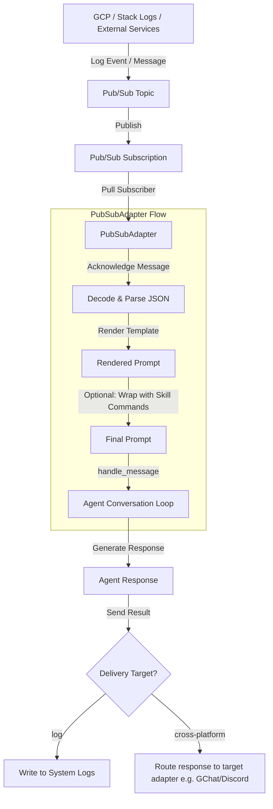

# Google Cloud Pub/Sub Platform Plugin

The Google Cloud Pub/Sub platform plugin connects the Kubernetes Agentic Harness (`kube-agents`) to GCP Pub/Sub pull subscriptions. It acts as an event receiver that pulls messages (such as log-based alerts from Cloud Logging sinks or notification events), parses them, and injects them as prompts into the agent's core conversation loop.

It also supports response routing, allowing the agent to post responses back to other chat platforms (cross-platform delivery) or write replies directly to the system logs.

## Architecture & Message Flow

The following diagram illustrates how the Pub/Sub plugin receives messages, processes them through the adapter, and routes agent responses back:



<details>
<summary>View Diagram Source</summary>



</details>

## Key Features

1. **Auto-Provisioning**: If specified in the subscription configuration, the adapter can automatically verify and create Pub/Sub topics, subscriptions, and stack log sinks, as well as grant necessary IAM permissions (`roles/pubsub.publisher`) to the log sink writer identity.
2. **Dynamic Prompt Rendering**: Supports template syntax (e.g. `{incident.summary}`) to format raw JSON message payloads into readable, context-rich prompts.
3. **Skill Wrapping**: Directly routes incoming alerts to specific agent skills by mapping route paths to skill names (e.g. wrapping stockout alerts with `/gke-stockout-handler`).
4. **Cross-Platform Response Delivery**: Agents can respond to other messaging channels (e.g., Google Chat space or a specific thread) from incoming alert logs.

## Configuration Guide

The Pub/Sub plugin configures route subscriptions in your agent's `config.yaml` under `platforms.pubsub.extra.subscriptions`.

### Example Configuration

```yaml
platforms:
  pubsub:
    enabled: true
    extra:
      subscriptions:
        gke_alerts:
          # (Optional) If topic/query is provided, the plugin auto-provisions GCP resources
          topic: "gke-alerts"
          query: 'resource.type="gke_cluster" AND severity>=WARNING'

          # Subscription path or name. If name is used, it resolves to projects/<project-id>/subscriptions/<subscription-name>
          subscription: "gke-alerts-sub"

          # Template for formatting incoming message payload
          prompt: |
            Alert policy triggered: {incident.summary}
            Resource: {incident.resource_name}
            URL: {incident.url}

            Full incident details:
            {__raw__}

          # Optionally trigger specific agent skill commands with the alert details
          skills:
            - gke-stockout-handler

          # Where to deliver the agent's response
          deliver: "google_chat"
          deliver_extra:
            chat_id: "spaces/AAAA12345"
            thread_id: "{incident.summary}" # Dynamically template the destination thread
```

### Configuration Parameters

| Parameter       | Type           | Required | Description                                                                                                                                          |
| :-------------- | :------------- | :------- | :--------------------------------------------------------------------------------------------------------------------------------------------------- |
| `topic`         | `string`       | No       | Simple topic name or full GCP resource path (`projects/<project>/topics/<name>`).                                                                    |
| `subscription`  | `string`       | Yes      | Simple subscription name or full GCP path (`projects/<project>/subscriptions/<name>`).                                                               |
| `query`         | `string`       | No       | GCP Cloud Logging filter query. If specified, a log sink is created/updated to route matching logs to the topic.                                     |
| `prompt`        | `string`       | Yes      | Markdown template. Supports placeholder substitution using dot-notation (e.g., `{incident.summary}`). Use `{__raw__}` for a raw JSON payload string. |
| `skills`        | `list[string]` | No       | List of skill command aliases (without leading `/`) that the agent should execute with the rendered prompt.                                          |
| `deliver`       | `string`       | Yes      | Destination platform for the response. Can be `log` (default) or any active platform adapter name (e.g., `google_chat`, `discord`).                  |
| `deliver_extra` | `dict`         | No       | Extra configuration variables for the target delivery adapter (e.g., `chat_id`, `thread_id`). Values support placeholder rendering.                  |
