# Kubernetes Agentic Harness Operator

This directory contains the Kubernetes Operator for the `kube-agents` harness. The operator defines and manages the lifecycle of agent custom resources:

- **PlatformAgent**: Manages platform-level configuration and capabilities.

The operator is built using the Kubebuilder framework and is written in Go.

---

## Prerequisites

Before building or deploying the operator, ensure you have the following installed:

- [Go](https://go.dev/doc/install) (version 1.26+)
- [Docker](https://docs.docker.com/get-docker/) or Podman (for building container images)
- [kubectl](https://kubernetes.io/docs/tasks/tools/) (configured to access your Kubernetes/GKE cluster)
- Access to a running Kubernetes/GKE cluster
- [gcloud](https://cloud.google.com/sdk/docs/install) (for GKE cluster access)

---

## Bootstrapping GCP & GKE Infrastructure

To simplify development and testing in a real GKE/GCP environment, you can use the automated provisioning and teardown workflow. This infrastructure is fully modularized and idempotent.

### 1. The Provisioning Pipeline

To bootstrap GCP APIs, a GKE Standard cluster, Artifact Registry, Secrets, Google Chat Pub/Sub resources, build and push containers, and apply the Custom Resource (CR) in one command:

```bash
make gcp-provision
```

Or execute the master script directly from the scripts folder:

```bash
./scripts/provision.sh [--dry-run]
```

#### How it Works & Modular Sub-scripts

The master [provision.sh](scripts/provision.sh) script orchestrates modular sub-scripts sequentially. Each sub-script is idempotent: it verifies the state of its resources before executing any action. If a resource already exists or a step was already completed, it is skipped.

> [!NOTE]
> Because the provisioning scripts persist configuration state in `scripts/vars.sh`, running the script again will reuse the same options selected on the first run. If you want to change configuration variables, manually edit `scripts/vars.sh` or perform a teardown first.

```mermaid
graph TD
    A[provision.sh] --> B[provision_01_gcp_cluster.sh]
    A --> C[provision_02_gvisor_nodepool.sh]
    A --> D[provision_03_gcp_gke_operator.sh]
    A --> E[provision_04_gcp_iam.sh]
    A --> F[provision_05_gcp_gchat.sh]
    A --> G[provision_06_slack.sh]
    A --> H[provision_07_gcp_k8s_secrets.sh]
    A --> I[provision_08_deploy_platform_agent.sh]
    A --> J[provision_09_deploy_litellm.sh]
    A --> K[provision_10_deploy_github_minter.sh]
    A --> L[provision_11_deploy_inference_replay.sh]
    A --> M[provision_12_gke_backup_plan.sh]
    A --> N[provision_14_verify_agent_rollout.sh]
```



Every step is documented once, in **[scripts/README.md](scripts/README.md)** — the canonical
reference for what each `provision_NN_*.sh` script does, in what order, and which variables it
reads. Run `make help` for the per-step targets.

#### Fast Local Development & Testing

For fast local iteration when updating agent skills, prompts, or code without waiting for CI/CD pipelines, you can use the dedicated rebuild script or `make` target:

```bash
# Run interactively via make
make dev-rebuild-agent

# Or specify arguments directly
make dev-rebuild-agent ARGS="platform"
```

- **[dev/dev_rebuild_agent.sh](scripts/dev/dev_rebuild_agent.sh)**:
  - Prompts for or accepts an agent target (`platform`).
  - Ensures the GCP Artifact Registry repository exists.
  - Builds and pushes the updated container image via Google Cloud Build (or locally with `--local`).
  - Automatically updates any running Custom Resources and rolling-restarts Kubernetes Deployments in GKE with the new image.

---

### 2. The Teardown Pipeline

To cleanly tear down and delete all provisioned GCP and GKE resources:

```bash
make gcp-teardown
```

Or run the master teardown script directly:

```bash
./scripts/teardown.sh
```

#### Modular Teardown Sub-scripts

```mermaid
graph TD
    A[teardown.sh] --> B[teardown_12_gke_backup_plan.sh]
    A --> C[teardown_11_deploy_inference_replay.sh]
    A --> D[teardown_10_deploy_github_minter.sh]
    A --> E[teardown_09_deploy_litellm.sh]
    A --> F[teardown_08_deploy_platform_agent.sh]
    A --> G[teardown_07_gcp_k8s_secrets.sh]
    A --> H[teardown_06_slack.sh]
    A --> I[teardown_05_gcp_gchat.sh]
    A --> J[teardown_04_gcp_iam.sh]
    A --> K[teardown_03_gcp_gke_operator.sh]
    A --> L[teardown_02_gvisor_nodepool.sh]
    A --> M[dev/teardown_dev_01_gcp_artifact_registry.sh]
    A --> N[teardown_01_gcp_cluster.sh]
```



Each teardown step mirrors its provisioning counterpart and is documented in
**[scripts/README.md](scripts/README.md)**.

---

### 3. Sourcing Variables & Configuration State

On the first execution of `make gcp-provision` (or `provision_01_gcp_cluster.sh`), you will be prompted for target values. These are saved to **`scripts/vars.sh`**.

Subsequent script runs will skip the interactive configuration and automatically load variables from `vars.sh`. To re-configure or customize settings, you can edit `vars.sh` directly or delete it to be prompted again.

---

### 4. Advanced Execution Options

- **Dry-Run Mode**: To print the actions that would be executed without modifying any cloud resources, pass `ARGS="--dry-run"`:
  ```bash
  make gcp-provision ARGS="--dry-run"
  ```

---

### 5. Running Individual Steps

Every pipeline step has its own idempotent `make` target that sources configuration from
`scripts/vars.sh`. Run `make help` in this directory for the current list — it is generated from
the Makefile itself, so it cannot drift from the targets that actually exist.

---

## Local Development (Fast Iteration)

For local development and testing, you can run the operator controller as a local Go process on your machine, while pointing it to a remote GKE or local Kubernetes cluster. This bypasses the need to build and push container images on every code change.

### Step 1: Set Active Kubernetes Context

Ensure your `kubectl` is pointed to the correct cluster:

```bash
# Check the active context
kubectl config current-context

# If needed, authenticate and switch to your GKE cluster
gcloud container clusters get-credentials <CLUSTER_NAME> --zone <ZONE> --project <PROJECT_ID>
```

### Step 2: Install the Custom Resource Definitions (CRDs)

Register the operator's Custom Resource Definitions (CRDs) with the cluster:

```bash
make install
```

> [!NOTE]
> This applies the CRD manifests **as committed** in `config/crd/bases/`, via `kustomize`. It does not run `controller-gen`, so edits to the Go API types do not reach the cluster until you run `make manifests` and install again. How the build targets and CI keep generated output in sync is covered in the [operator development guide](../docs/site/src/content/docs/operator/development.md).

### Step 3: Run the Operator Locally

Start the operator controller process. Because admission webhooks require TLS certificates (typically managed by cert-manager when running inside the cluster), you should run the operator locally with webhooks disabled by setting the `ENABLE_WEBHOOKS=false` environment variable:

```bash
ENABLE_WEBHOOKS=false make run
```

Or directly run the main entry point:

```bash
ENABLE_WEBHOOKS=false go run ./cmd/main.go
```

> [!TIP]
> This compiles and runs the entry point [main.go](cmd/main.go) with webhooks disabled. The process runs in the foreground, prints reconciliation logs, and watches for custom resource events in the cluster.

When webhooks are enabled, the server binds `10250` rather than Kubebuilder's usual `9443`: it is one of only two ports GKE's automatic control-plane-to-node firewall rule permits, so a private cluster reaches the webhook without a hand-added VPC rule. Where 10250 is not the reachable port, `--webhook-port`, the manager `containerPort`, and the Service `targetPort` have to be changed together — the flag alone moves the listener and leaves the Service dialing a dead port, which fail-closed admission turns into a wedged cluster. The rationale, the Kustomize patch that moves all three, the drift guard across them, and the recovery steps for an unreachable webhook are in [Admission webhooks](../docs/site/src/content/docs/operator/index.md#admission-webhooks).

### Step 4: Apply Sample Custom Resources

In another terminal window, apply the sample custom resources to test the controllers:

```bash
kubectl apply -f examples/platformagent.yaml
```

Verify that the resources are created and recognized:

```bash
kubectl get platformagents --all-namespaces
```

You should see reconciliation logs printed in the terminal where the operator process is running.

### Step 5: Clean Up Local Resources

To stop the operator, press `Ctrl+C` in the terminal where it is running.
To uninstall the CRDs from the cluster:

```bash
make uninstall
```

---

## Building and Deploying to GKE

When you are ready to deploy the operator as a deployment inside the cluster, use the following steps.

### Step 1: Build and Push the Docker Image

Build the container image and push it to a container registry (e.g., Google Artifact Registry) accessible by your GKE cluster.

#### 1. Authenticate Docker with the Registry

Before pushing, ensure your local Docker client is authenticated with Google Cloud's container registries. Run the command matching your registry domain:

```bash
# For Google Artifact Registry (recommended, e.g. us-central1 region)
gcloud auth configure-docker us-central1-docker.pkg.dev

# For Google Container Registry (legacy)
gcloud auth configure-docker gcr.io
```

#### 2. Build and Push

Set the image target URL and run the build/push targets:

```bash
# Replace with your actual registry and image tag
export IMG=us-central1-docker.pkg.dev/ai-platform-1-464114/k8s-harness-poc/kube-agents-operator:latest

# Build the image
make docker-build IMG=$IMG

# Push the image to the registry
make docker-push IMG=$IMG
```

### Step 2: Deploy the Operator Controller

Deploy the operator deployment, RBAC permissions, and CRDs into the cluster:

```bash
make deploy IMG=$IMG
```

### Step 3: Verify the Deployment

Check the status of the operator deployment:

```bash
kubectl get deployments -n kubeagents-system
kubectl get pods -n kubeagents-system
```

---

## Deploying LiteLLM Integration

> [!NOTE]
> LiteLLM is now automatically deployed during the `make gcp-provision` flow by `provision_09_deploy_litellm.sh`. The following instructions are for manual standalone deployment.

LiteLLM gateway can be deployed to the Kubernetes cluster using the `kustomize` targets in the Makefile.

### Prerequisites

To successfully deploy LiteLLM, you must have:

1. The `platform-agent-secrets` Secret created in your destination namespace (containing `GEMINI_API_KEY`, `ANTHROPIC_API_KEY`, or `OPENAI_API_KEY`).

### Step-by-Step Deployment

Run the `make deploy-litellm` target, passing the required environment variables:

```bash
# 1. Define model provider and default model name:
export MODEL_PROVIDER=gemini
export MODEL_DEFAULT_NAME=gemini-3.5-flash

# 2. Deploy LiteLLM:
make deploy-litellm
```

To uninstall/remove the LiteLLM integration:

```bash
make undeploy-litellm
```

---

## Deploying GitHub Integration

The GitHub Token Broker (Minty) can be deployed to the Kubernetes cluster using the `kustomize` targets in the Makefile.

### Prerequisites

Before deploying the GitHub integration, ensure you have:

1. Created the `github-app-credentials` Secret containing your GitHub App ID in the destination namespace.
2. Completed the Workload Identity and GCP Cloud KMS setup (see [config/integrations/github/README.md](config/integrations/github/README.md) for details).

### Step-by-Step Deployment

Run the `make deploy-github` target, passing the required environment variables. The KSA/GSA names below are the same defaults the provisioning scripts use (see [`scripts/common.sh`](scripts/common.sh)), but they still have to be exported here: `make deploy-github` renders the manifests with `envsubst` and does not source `common.sh`, so an unset variable would be substituted as an empty string.

`KMS_LOCATION` is the Cloud KMS location, which is separate from `REGION`, the GKE cluster location. Cloud KMS has no zonal locations, so the two differ for a zonal cluster: a cluster in `us-central1-c` needs `KMS_LOCATION=us-central1`. For a regional cluster they are the same value.

`GITHUB_ORG` must name a GitHub organization, not a user: the Minter resolves installations at `/orgs/{org}/installation`, which returns 404 for personal accounts. This path bypasses the provisioning scripts that check for it — see [`config/integrations/github/README.md`](config/integrations/github/README.md).

```bash
# 1. Define the GCP and GitHub parameter variables:
export PROJECT_ID=your-gcp-project-id
export REGION=your-gcp-region
export CLUSTER_NAME=your-gke-cluster-name
export KMS_LOCATION=your-kms-region
export KMS_KEYRING=your-kms-keyring
export KMS_KEY=your-kms-key
export KMS_KEY_VERSION=your-kms-key-version
export GITHUB_ORG=your-github-org
export GITHUB_REPO=your-github-repo
export GITHUB_MINTER_KSA_NAME=kubeagents-github-minter
export GITHUB_MINTER_GSA_NAME=kubeagents-github-minter-gsa
export PLATFORM_AGENT_GSA_NAME=kubeagents-platform-gsa

# 2. Deploy GitHub:
make deploy-github
```

To uninstall/remove the GitHub integration:

```bash
make undeploy-github
```

---

## Makefile Reference

```bash
make help
```

`make help` prints every documented target with its description, generated from the Makefile.
It replaces the table that previously lived here, which had to be updated by hand whenever a
target changed.

---

## Key Files & Code Pointers

- **Main Entrypoint**: [main.go](cmd/main.go)
- **Controllers**:
  - [PlatformAgent Controller](internal/controller/platformagent_controller.go)
- **Example Resource**: [platformagent.yaml](examples/platformagent.yaml)
- **Makefile**: [Makefile](Makefile)
